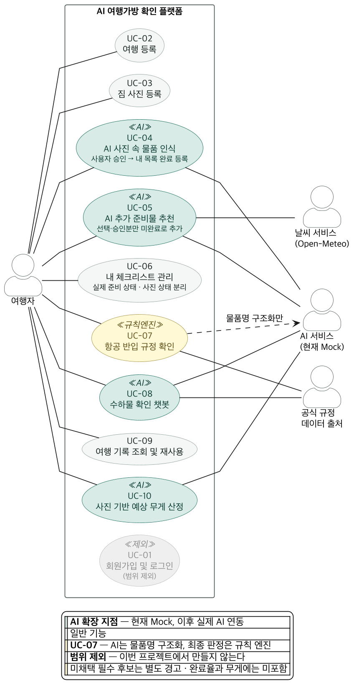

# Use-Case

> 발표 1번 섹션 (3분): 핵심 Actor 및 Use-Case 요약
>
> 채점 기준: **"Use-Case 정의 및 UI 와이어프레임 완성도"**,
> **"AI 확장 지점 정의 및 프롬프트/JSON 스키마 타당성"**

출처는 Notion **「기능 정의」** (v2, 2026-09-02)다. 기능 ID `F-xx`는 4절
상세 기능 표를 정본으로 사용하며, `UC-xx`와 1:1로 대응한다. 3절 7단계의
준비물 비교·검수는 별도 기능 ID가 없어 UC-06 체크리스트 관리 범위에 포함한다.

## Use-Case 다이어그램



- 원본: [`images/02-usecase.puml`](images/02-usecase.puml) (PlantUML)
- 벡터: [`images/02-usecase.svg`](images/02-usecase.svg) — 발표 슬라이드 권장
- 수정: `.puml`을 PlantUML 웹 편집기에 붙여넣거나 VS Code PlantUML 확장에서
  `Alt+D`로 미리 본다. 아래 표를 바꾸면 `.puml`도 함께 고친다.

## Actor와 연결 검증

사람 Actor는 **여행자 한 명**이다. 회원·비회원을 구분하지 않기로 했으므로
(로그인이 없다, [`01-service-plan.md`](01-service-plan.md)) 인증 상태에 따른
분기도 없다. 모든 사용자가 같은 경로를 쓴다.

| Actor | 구분 | 연결 Use-Case | 근거 |
| --- | --- | --- | --- |
| **여행자** | 사람 | UC-02~UC-10 | 모든 기능에서 입력·검토·수정·확정·조회 행위를 수행한다 |
| **AI 서비스** | 외부 시스템 | UC-04, UC-05, UC-07(부분), UC-08, UC-10 | 물품 인식, 맞춤 추천, 대화 처리, 사진 기반 무게 추정을 담당한다. UC-07에서는 물품명 구조화만 하며 현재는 Mock이다 |
| **날씨 서비스** | 외부 시스템 | UC-05 | 맞춤 체크리스트 생성에 예상 날씨를 제공한다 |
| **공식 규정 데이터 출처** | 외부 시스템 | UC-07, UC-08 | 항공 반입 판정과 챗봇 답변에 공식 규정과 근거를 제공한다 |

규칙 엔진은 플랫폼 내부 구성요소이므로 Actor로 두지 않는다. 최종 반입 판정은
AI가 아니라 버전 관리된 공식 규정을 사용하는 규칙 엔진이 담당한다.

## Use-Case 목록

| ID | 기능 ID | Use-Case | Actor | 목적 | 우선순위 |
| --- | --- | --- | --- | --- | --- |
| UC-01 | F-01 | ~~회원가입 및 로그인~~ | — | **범위 제외.** 회원·비회원을 구분하지 않기로 해 로그인 화면을 두지 않는다. 시드 사용자 한 명으로 고정한다 | 제외 |
| UC-02 | F-02 | 여행 등록 | 여행자 | 추천과 수하물 판단에 필요한 여행 조건을 구조화한다 | Must |
| UC-03 | F-03 | 짐 사진 등록 | 여행자 | 물품 인식에 적합한 이미지를 안정적으로 수집한다 | Must |
| UC-04 | F-04 | **AI 사진 속 물품 인식** | 여행자 ↔ **AI 서비스** | 물품 후보와 수량을 구조화해 비교·무게 계산의 기초자료를 만든다 | Must |
| UC-05 | F-05 | **AI 맞춤 체크리스트 생성** | 여행자 ↔ **AI 서비스**, 날씨 서비스 | 여행 조건과 예상 날씨에 맞는 준비물을 제안한다 | Must |
| UC-06 | F-06 + 흐름 7단계 | 체크리스트 관리 | 여행자 | 체크리스트를 관리하고 승인 물품과 비교해 준비 상태를 확정한다 | Must |
| UC-07 | F-07 | 항공 반입 규정 확인 | 여행자 ↔ **AI 서비스**(부분), 공식 규정 데이터 출처 | 공식 기준으로 물품별 기내·위탁 가능 여부를 안내한다 | Must |
| UC-08 | F-08 | **수하물 확인 챗봇** | 여행자 ↔ **AI 서비스**, 공식 규정 데이터 출처 | 복잡한 수하물 질문을 대화형으로 해결한다 | Should |
| UC-09 | F-09 | 여행 기록 조회 및 재사용 | 여행자 | 반복 여행의 준비 시간을 줄인다 | Should |
| UC-10 | F-10 | **사진 기반 예상 무게 산정** | 여행자 ↔ **AI 서비스** | 가방 총중량과 한도 초과 가능성을 추정한다 | Must·Beta |

우선순위는 기능 정의 4절의 값을 옮겼다. `Must·Beta`는 핵심 범위에 포함하되
추정 정확도와 신뢰도 표시는 베타 수준으로 검증한다는 뜻이다. 화면 구현의
`1차/2차/3차` 우선순위와는 다른 축이다.

## 주요 Use-Case 상세

### UC-02: 여행 등록

| 항목 | 내용 |
| --- | --- |
| Actor | 여행자 |
| 사전 조건 | 없음. 로그인하지 않는다 |
| 기본 흐름 | 1. 일정·출발지·도착지·목적·이동수단을 입력한다<br>2. 항공 이용이면 항공사·공항·경유지를 입력한다<br>3. 가방 유형·허용 한도와 선택 정보를 입력한다<br>4. 시스템이 날짜·노선·필수값을 검증한다<br>5. 여행 프로필을 저장한다 |
| 대체·예외 흐름 | 귀국일 역전·필수값 누락은 수정을 요청한다. 항공사·경유지가 없으면 일반 기준만 제공하고 정확도 제한을 표시한다 |
| 사후 조건 | 여행 프로필이 추천·규정 조회의 입력으로 저장된다 |
| 관련 API | `POST /api/trips` → `201 Created` |
| 관련 화면 | `S-02` 여행 등록 |

### UC-04: AI 사진 속 물품 인식

| 항목 | 내용 |
| --- | --- |
| Actor | 여행자 ↔ AI 서비스 |
| 사전 조건 | 검수 가능한 사진이 한 장 이상 등록되었다(UC-03) |
| 기본 흐름 | 1. AI 작업을 접수하고 작업 ID를 반환한다<br>2. 화면은 분석 중 상태를 표시하고 폴링한다<br>3. 물품 후보·수량·신뢰도와 OCR 결과를 만든다<br>4. 사진 간 중복 후보를 병합한다<br>5. 여행자가 이름·수량을 수정하고 승인한다 |
| 대체·예외 흐름 | 낮은 신뢰도는 복수 후보를 제시한다. 보이지 않는 용량·정격·날 길이는 라벨 사진이나 직접 입력을 요청한다 |
| 사후 조건 | **승인된 물품이 체크리스트 항목으로 등록된다(UC-05).** 승인된 물품만 UC-05·UC-06·UC-07·UC-10에 반영할 수 있다 |
| 관련 API | `POST /api/ai-jobs` (`jobType: BAG_CHECK`) → `202`<br>`GET /api/ai-jobs/{jobId}` → `200` |
| 관련 화면 | `S-04` 인식 결과·승인 |

### UC-05: AI 맞춤 체크리스트 생성

| 항목 | 내용 |
| --- | --- |
| Actor | 여행자 ↔ AI 서비스, 날씨 서비스 |
| 사전 조건 | 여행 등록(UC-02)이 완료되었다. 사진을 올렸다면 승인된 인식 결과(UC-04)가 함께 입력된다 |
| 기본 흐름 | 1. **승인된 인식 결과를 체크리스트 항목으로 등록한다**<br>2. 여행 정보와 예상 날씨를 불러온다<br>3. AI 작업을 접수하고 작업 ID를 반환한다<br>4. 여행 목적·기간·장소·계절에 맞는 준비물 후보를 만들되, **이미 등록된 물품은 제외하고 부족한 것만** 제안한다<br>5. 고정 필수 규칙으로 결과를 보강한다<br>6. 여행자가 추가·수정·삭제 후 확정한다 |
| 대체·예외 흐름 | 예보 범위 초과·날씨 조회 실패 시 계절 평균과 데이터 시점을 표시한다. AI 실패 시 기본 체크리스트를 제공한다 |
| 사후 조건 | 사진에서 확인된 물품과 AI가 덧붙인 부족분이 **출처가 구분된 채로** 한 체크리스트에 저장된다 |
| 관련 API | `POST /api/ai-jobs` (`jobType: PACKING_LIST`) → `202`<br>`GET /api/ai-jobs/{jobId}` → `200` |
| 관련 화면 | `S-05` 체크리스트 |

### UC-06: 체크리스트 관리·준비물 비교

| 항목 | 내용 |
| --- | --- |
| Actor | 여행자 |
| 사전 조건 | 체크리스트가 있다(UC-05). 사진을 올리지 않은 경우 AI 추천 항목만으로 구성된다 |
| 기본 흐름 | 1. 항목을 추가·삭제·수정·정렬하고 완료 상태를 관리한다<br>2. 승인 물품과 체크리스트를 표준 품목 기준으로 대조한다<br>3. 준비 완료·확인 필요·사진에서 미확인·추가 물품으로 분류한다<br>4. 여행자가 상태를 최종 확인한다 |
| 대체·예외 흐름 | 사진에서 찾지 못한 항목을 누락으로 단정하지 않는다. 중복 항목은 병합을 제안하고 필수 항목 삭제는 재확인한다 |
| 사후 조건 | 최신 체크리스트, 준비 완료율과 비교 상태가 저장된다 |
| 관련 API | `PATCH /api/trips/{tripId}/items/{itemId}` → `200` |
| 관련 화면 | `S-05` 체크리스트, `S-06` 검수 결과 |

### UC-07: 항공 반입 규정 확인

| 항목 | 내용 |
| --- | --- |
| Actor | 여행자 ↔ AI 서비스(부분), 공식 규정 데이터 출처 |
| 사전 조건 | 항공 여행 정보와 확인할 물품이 등록되어 있다 |
| 기본 흐름 | 1. AI가 사진·질문에서 물품명을 구조화한다<br>2. 용량·배터리 Wh·날 길이 등 필수정보를 확인한다<br>3. 규칙 엔진이 공식 규정과 입력값을 비교한다<br>4. 반입 상태·근거·확인 날짜·최종 확인 경로를 표시한다 |
| 대체·예외 흐름 | 정보가 부족하면 판정을 보류한다. 규정이 충돌하면 더 엄격한 기준을 경고하고 항공사 확인 경로를 제공한다 |
| 사후 조건 | 물품별 반입 상태와 근거가 저장된다 |
| 관련 API | `GET /api/rules?transport=&keyword=` → `200`<br>`POST /api/ai-jobs` (`jobType: RULE_CHECK`) → `202` |
| 관련 화면 | `S-06` 검수 결과, `S-08` 반입 규정 상세 |
| 책임 경계 | **최종 판정은 규칙 엔진이 한다.** AI는 물품명 구조화와 설명만 담당한다 |

### UC-08: 수하물 확인 챗봇

| 항목 | 내용 |
| --- | --- |
| Actor | 여행자 ↔ AI 서비스, 공식 규정 데이터 출처 |
| 사전 조건 | 없음. 여행 정보가 없으면 대화 중 출발지·도착지·항공사를 입력한다 |
| 기본 흐름 | 1. 질문에서 물품명과 여행 조건을 추출한다<br>2. 부족한 조건을 한 번에 하나씩 확인한다<br>3. 규칙 엔진을 호출한다<br>4. 결론·이유·권장 행동·공식 출처를 답한다 |
| 대체·예외 흐름 | 품목이 모호하거나 규정이 상충·만료되면 단정하지 않고 담당기관 확인을 권고한다 |
| 사후 조건 | 판정 결과와 근거가 `ai_jobs` 작업 단위로 남는다. **대화 이력은 저장하지 않는다** — 범위 제외([`01-service-plan.md`](01-service-plan.md)) |
| 관련 API | `POST /api/ai-jobs` (`jobType: RULE_CHECK`) → `202`<br>`GET /api/ai-jobs/{jobId}` → `200` |
| 관련 화면 | `S-09` 챗봇 |

### UC-10: 사진 기반 예상 무게 산정

| 항목 | 내용 |
| --- | --- |
| Actor | 여행자 ↔ AI 서비스 |
| 사전 조건 | 여행자가 승인한 물품 목록(UC-04)이 있다 |
| 기본 흐름 | 1. 가방 종류·빈 무게와 선택 정보를 입력받는다<br>2. 품목별 최소·대표·최대 중량을 합산한다<br>3. 가림·미식별 비율로 신뢰도를 조정한다<br>4. 총중량 범위·품목별 기여도·한도 초과 가능성을 표시한다 |
| 대체·예외 흐름 | 승인 전 후보는 합계에서 제외한다. 닫힌 가방·심한 겹침은 계산을 중단하고 재촬영을 요청한다. 한도 근접 시 실제 저울 측정을 권고한다 |
| 사후 조건 | 예상 무게 범위와 신뢰도가 저장된다. **실측값 입력·저장은 이번 범위가 아니다 (TBD)** — 담을 컬럼을 두지 않았다 |
| 관련 API | `POST /api/ai-jobs` (`jobType: WEIGHT_ESTIMATE`) → `202`<br>`GET /api/ai-jobs/{jobId}` → `200` |
| 관련 화면 | `S-06` 검수 결과, `S-07` 무게 상세 |

## 관계 표현 원칙

다이어그램에는 Actor와 직접 상호작용하는 Use-Case의 association만 표시한다.
기능표의 입력·출력 의존성은 실행 순서이지 `include`·`extend` 관계라는 근거가
아니므로 임의의 Use-Case 관계를 추가하지 않는다.

### 기능 의존성

다음은 다이어그램의 관계선이 아니라 기능 간 입력·출력 의존성이다.

| 선행 Use-Case | 사용하는 Use-Case | 전달 정보 |
| --- | --- | --- |
| UC-02 여행 등록 | UC-05, UC-07, UC-08, UC-10 | 일정·노선·항공사·수하물 한도 |
| UC-03 짐 사진 등록 | UC-04 | 검수된 유효 사진 |
| UC-04 물품 인식 | **UC-05**, UC-06, UC-07, UC-10 | 여행자가 승인한 물품명·수량·라벨 정보 |
| UC-05 체크리스트 생성 | UC-06 | 여행별 기본 체크리스트 |
| UC-09 기록 조회·재사용 | UC-02, UC-05 | 이전 여행 프로필과 체크리스트 초안 |

## AI 확장 지점 정리

| Use-Case | `jobType` | 현재 | 향후 | 바뀌는 곳 |
| --- | --- | --- | --- | --- |
| UC-04 물품 인식 | `BAG_CHECK` | Mock 인식 결과 | 비전 모델 결과 | 백엔드 내부 |
| UC-05 체크리스트 생성 | `PACKING_LIST` | Mock 추천 목록 | LLM 추천 목록 | 백엔드 내부 |
| UC-07 반입 규정 확인(부분) | `RULE_CHECK` | Mock 물품명 | AI 물품명 구조화 + 규칙 엔진 판정 | 백엔드 내부 |
| UC-08 수하물 확인 챗봇 | `RULE_CHECK` | Mock 답변 | AI 설명 + 규칙 엔진 판정 | 백엔드 내부 |
| UC-10 예상 무게 산정 | `WEIGHT_ESTIMATE` | Mock 범위 | 품목 중량 데이터 + AI 보정 | 백엔드 내부 |

AI 작업은 `POST /api/ai-jobs` 하나에서 `jobType`으로 구분한다. 프런트엔드와
API 규격을 유지한 채 백엔드 내부 구현만 교체하는 것이 AI-Ready 원칙이다.
근거는 [ADR 0003](adr/0003-ai-job-endpoint.md)이다.

## 책임 경계

| 주체 | 담당 범위 | 하지 않는 것 |
| --- | --- | --- |
| 생성형 AI | 준비물 추천, 질문 의도 파악, 설명과 요약 | 공식 규정의 최종 판정이나 실제 무게 확정 |
| 이미지 AI·OCR | 물품 후보, 수량, 라벨 정보, 신뢰도 추정 | 보이지 않는 속성의 확정 또는 승인 전 결과의 최종 반영 |
| 규칙 엔진 | 공식 규정과 사용자 조건 비교 | 정보 부족·규정 충돌 상황의 확정 판정 |
| 여행자 | 인식 결과 승인, 준비 여부와 최종 반입 확인 | 서비스 결과로 출발 당일 관계기관 판단 대체 |

## 원본 명세의 불일치와 팀 확정 사항

### ① 기능 번호 — 4절 상세 기능 표를 정본으로 한다

| 위치 | 무게 | 챗봇 | 재사용 |
| --- | --- | --- | --- |
| **4절 상세 기능 표(정본)** | **F-10** | **F-08** | **F-09** |
| 6절 제목 | F-11 | — | — |
| 4절 F-04 예외 문구 | F-11 | — | — |
| 8절 로드맵 | F-11 | F-09 | F-10 |

가장 완전한 4절 표를 기준으로 확정한다. Notion의 다른 절도 무게 F-10, 챗봇
F-08, 기록 재사용 F-09로 고쳐야 한다.

### ② 사진과 체크리스트의 선후 — 사진이 먼저다

```text
사진 등록(UC-03) → 물품 인식(UC-04) → 체크리스트 생성(UC-05) → 관리·비교(UC-06)
```

**F-05 목적을 글자 그대로 따른다.**

> *"**이미지 인식을 통해 확인된 물품 체크리스트에 등록** 및 여행 조건에 맞는
> 준비물을 빠짐없이 제안한다."*

인식 결과가 체크리스트의 **선행 입력**이다. 승인된 물품이 항목으로 등록되고,
AI는 그 위에 여행 조건·날씨로 **부족한 것만** 덧붙인다. 이미 가방에 있는 것을
다시 추천하지 않는다.

`F-01`~`F-10`의 번호 순서가 이 흐름과 그대로 맞는다. `UC-xx`가 `F-xx`와 1:1이므로
UC 번호도 흐름 순서다.

준비물 비교는 독립 기능 ID를 만들지 않고 UC-06 체크리스트 관리에 포함하며,
사진에서 찾지 못한 항목은 자동 누락으로 판정하지 않는다.

#### 이전 결정을 뒤집었다

[#14](https://github.com/SangMyeong5426/skala-mini-ai-web-service/pull/14)에서는
기능 정의 3절 「전체 서비스 흐름」의 `③ 체크리스트 생성 → ④ 짐 사진 등록` 을 따라
**체크리스트가 먼저**로 정했고, F-05 목적의 위 문장은 *"선행 입력이 아니라 뒤 단계인
목록 비교"* 로 해석했다.

**원본 명세가 자기 안에서 어긋나 있다.**

| Notion 「기능 정의」 | 순서 |
| --- | --- |
| 3절 전체 서비스 흐름 | 체크리스트(③) → 사진(④) |
| 페르소나 1·3 이용 흐름 | 체크리스트 → 사진 |
| **4절 F-05 목적** | **사진 인식 → 체크리스트 등록** |
| **4절 F 번호 순서** | **F-03 사진 → F-04 인식 → F-05 체크리스트** |

체크리스트를 먼저 확정하게 하면 사용자는 사진에 닿기 전에 목록을 검토해야 하고,
그 순간 *"사진만 찍으면 알려준다"* 는 페르소나 김지우의 요구와 한 줄 정의
*"가방 사진 한 장으로"* 가 성립하지 않는다. 그래서 F-05 목적과 F 번호 순서를
따르기로 했다.

**Notion 3절과 페르소나 1·3 이용 흐름을 이 순서로 고쳤다 (2026-09-03).** 원본과 저장소가 이제 같다.

### ③ 원본 오타

기능 정의 1절의 `제공한다.x`, 페르소나 1 이용 흐름의 `여행 등록보 등록 → 맞춤
체크리스트 생성 생성보 생성`은 Notion에서 교정해야 한다.
