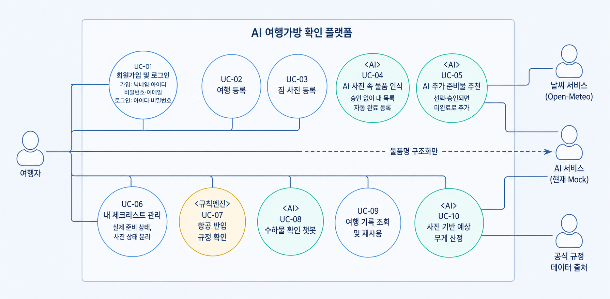

# Use-Case

> 발표 1번 섹션 (3분): 핵심 Actor 및 Use-Case 요약
>
> 채점 기준: **"Use-Case 정의 및 UI 와이어프레임 완성도"**,
> **"AI 확장 지점 정의 및 프롬프트/JSON 스키마 타당성"**

출처는 [Notion 「기능 정의」](https://app.notion.com/p/3cfa9fc8c93880bca5cac260a0900b70) (v2, 2026-09-02)다. 기능 ID `F-xx`는 4절
상세 기능 표를 정본으로 사용하며, `UC-xx`와 1:1로 대응한다. 3절 7단계의
준비물 비교·검수는 별도 기능 ID가 없어 UC-06 체크리스트 관리 범위에 포함한다.

> **2026-09-03 개정 반영:** [개인 Notion 「기능 정의 개정안」](https://app.notion.com/p/3d0c2ab24ce881d9b06cc065c47b1eb7)의
> F-04~F-06을 적용했다. 사진 자동 등록으로 내 목록을 만들고, 추가 추천은 별도 후보로
> 제시한다. 사용자가 채택한 후보만 미완료로 추가한다.
> 이 PR의 적용 자료이며 **팀 정본 변경을 확정한 것은 아니다.** 기존 팀 개정안 링크와
> 정본·동기화 확인 사항은 아래 「③ 원본·개정안·데모 범위의 구분」에 보존한다.


## Use-Case 다이어그램

> **2026-09-03 PNG·PUML·SVG 개정 반영.** UC-05 추가 추천·선택 채택, UC-04 사진 자동 등록과
> UC-06 실제 준비 상태를 아래 표와 맞췄다. 로그인 최종 결정에 따라 UC-01을 복원하고 전체 기능의 선행 인증 조건을 표시한다.



<details>
<summary>PlantUML 원본 버전 (구조 검증용)</summary>


</details>

- 발표본: [`images/02-usecase-visual.png`](images/02-usecase-visual.png) — 위 이미지
- 원본: [`images/02-usecase.puml`](images/02-usecase.puml) (PlantUML)
- 벡터: [`images/02-usecase.svg`](images/02-usecase.svg) — 발표 슬라이드 권장
- 수정: `.puml`을 PlantUML 웹 편집기에 붙여넣거나 VS Code PlantUML 확장에서
  `Alt+D`로 미리 본다. 아래 표를 바꾸면 `.puml`도 함께 고친다.

## Actor와 연결 검증

사람 Actor는 **여행자 한 명**이며 로그인 전·후는 같은 사람의 상태다.
UC-01에서 가입·로그인하고, **UC-02~UC-10은 로그인한 여행자만 실행**한다.
여행 등록이 필요 없는 챗봇도 로그인은 필요하다. 단순한 선행 조건이므로 모든 UC에
불필요한 `include` 선을 추가하지 않고 공통 사전 조건으로 명시한다.

| Actor | 구분 | 연결 Use-Case | 근거 |
| --- | --- | --- | --- |
| **여행자** | 사람 | UC-01~UC-10 | 모든 기능에서 입력·검토·수정·확정·조회 행위를 수행한다 |
| **AI 서비스** | 외부 시스템 | UC-04, UC-05, UC-07(부분), UC-08, UC-10 | 물품 인식, 맞춤 추천, 대화 처리, 사진 기반 무게 추정을 담당한다. UC-07에서는 물품명 구조화만 하며 현재는 Mock이다 |
| **날씨 서비스** | 외부 시스템 | UC-05 | 추가 준비물 후보 생성에 예상 날씨를 제공한다 |
| **공식 규정 데이터 출처** | 외부 시스템 | UC-07, UC-08 | 항공 반입 판정과 챗봇 답변에 공식 규정과 근거를 제공한다 |

규칙 엔진은 플랫폼 내부 구성요소이므로 Actor로 두지 않는다. 최종 반입 판정은
AI가 아니라 버전 관리된 공식 규정을 사용하는 규칙 엔진이 담당한다.

## Use-Case 목록

| ID | 기능 ID | Use-Case | Actor | 목적 | 우선순위 |
| --- | --- | --- | --- | --- | --- |
| UC-01 | F-01 | **회원가입 및 로그인** | 여행자 | 4개 정보로 가입하고 아이디·비밀번호로 로그인해 본인 자료만 이용한다. 로그아웃·세션 만료를 처리한다 | Must |
| UC-02 | F-02 | 여행 등록 | 여행자 | 추천과 수하물 판단에 필요한 여행 조건을 구조화한다 | Must |
| UC-03 | F-03 | 짐 사진 등록 | 여행자 | 물품 인식에 적합한 이미지를 안정적으로 수집한다 | Must |
| UC-04 | F-04 | **AI 사진 속 물품 인식** | 여행자 ↔ **AI 서비스** | 인식 물품을 승인 없이 내 목록에 챙김 완료로 자동 등록한다 | Must |
| UC-05 | F-05 | **AI 추가 준비물 추천** | 여행자 ↔ **AI 서비스**, 날씨 서비스 | 현재 내 목록을 제외한 후보를 별도 제시하고 필요한 것만 선택·승인받는다 | Must |
| UC-06 | F-06 + 준비물 비교 | 내 체크리스트 관리 | 여행자 | 채택한 내 목록의 실제 준비 상태와 사진 확인 상태를 관리한다 | Must |
| UC-07 | F-07 | 항공 반입 규정 확인 | 여행자 ↔ **AI 서비스**(부분), 공식 규정 데이터 출처 | 공식 기준으로 물품별 기내·위탁 가능 여부를 안내한다 | Must |
| UC-08 | F-08 | **수하물 확인 챗봇** | 여행자 ↔ **AI 서비스**, 공식 규정 데이터 출처 | 복잡한 수하물 질문을 대화형으로 해결한다 | Should |
| UC-09 | F-09 | 여행 기록 조회 및 재사용 | 여행자 | 반복 여행의 준비 시간을 줄인다 | Should |
| UC-10 | F-10 | **사진 기반 예상 무게 산정** | 여행자 ↔ **AI 서비스** | 가방 총중량과 한도 초과 가능성을 추정한다 | Must·Beta |

우선순위는 기능 정의 4절의 값을 옮겼다. `Must·Beta`는 핵심 범위에 포함하되
추정 정확도와 신뢰도 표시는 베타 수준으로 검증한다는 뜻이다. 화면 구현의
`1차/2차/3차` 우선순위와는 다른 축이다.

## 주요 Use-Case 상세

**공통 사전 조건:** UC-02~UC-10 전체에 유효한 로그인 세션이 필요하다. 자료를 지정하는
작업은 세션 사용자가 소유한 여행·항목·사진·AI 작업만 사용한다. 아래 사전 조건은 여기에 더한다.

### UC-01: 회원가입 및 로그인

| 항목 | 내용 |
| --- | --- |
| Actor | 여행자 |
| 사전 조건 | 서비스 접속. 비로그인 사용자는 이 인증 단계만 이용할 수 있다 |
| 기본 흐름 | 1. S-00에서 기존 회원은 아이디·비밀번호로 로그인한다<br>2. 신규 회원은 닉네임·아이디·비밀번호·이메일 4개로 가입하고 로그인 모드로 돌아온다<br>3. 서버가 자격을 검증하고 세션을 발급한다<br>4. S-01 홈에서 본인 여행을 조회한다 |
| 대체·예외 흐름 | 잘못된 형식·아이디/이메일 중복은 수정 요청. 로그인 실패는 공통 오류. 만료·로그아웃 시 서비스 접근을 차단하고 로그인으로 이동 |
| 사후 조건 | 인증된 사용자의 내부 userId로 소유권을 확인한다. 로그아웃은 서버 세션 폐기·FE 상태 정리 |
| 관련 API | `POST /api/auth/signup`, `POST /api/auth/login`, `GET /api/auth/session`, `POST /api/auth/logout` (06) |
| 관련 화면 | S-00 로그인·회원가입(한 화면), 로그인 성공 후 S-01 |


### UC-02: 여행 등록

| 항목 | 내용 |
| --- | --- |
| Actor | 여행자 |
| 사전 조건 | 로그인 완료 |
| 기본 흐름 | 1. 일정·출발지·도착지·목적지 국가 코드·목적·이동수단을 입력한다<br>2. 항공 이용이면 항공사·공항·경유지를 입력한다<br>3. 가방 유형·허용 한도와 선택 정보를 입력한다<br>4. 시스템이 날짜·노선·필수값을 검증한다<br>5. 여행 프로필을 저장한다 |
| 대체·예외 흐름 | 귀국일 역전·필수값 누락은 수정을 요청한다. 항공사·경유지가 없으면 일반 기준만 제공하고 정확도 제한을 표시한다 |
| 사후 조건 | 여행 프로필이 추천·규정 조회의 입력으로 저장된다 |
| 관련 API | `POST /api/trips` → `201 Created` |
| 관련 화면 | `S-02` 여행 등록 |

### UC-04: AI 사진 속 물품 인식

| 항목 | 내용 |
| --- | --- |
| Actor | 여행자 ↔ AI 서비스 |
| 사전 조건 | 검수 가능한 사진이 한 장 이상 등록되었다(UC-03). 체크리스트는 없어도 된다 |
| 기본 흐름 | 1. AI 작업을 접수하고 작업 ID를 반환한다<br>2. 화면은 분석 중 상태를 표시하고 폴링한다<br>3. 물품명·수량·신뢰도와 OCR 결과를 만든다<br>4. 서버가 동일 항목에 연결하거나 새 항목을 생성하고 챙김 완료로 자동 등록한다<br>5. 등록이 저장된 뒤 작업을 COMPLETED로 반환한다<br>6. 사용자는 필요할 때 이름·수량·연결을 사후 수정한다 |
| 대체·예외 흐름 | 낮은 신뢰도도 자동 등록하되 확인 필요로 표시한다. 분석 실패 사진은 등록하지 않고 재시도한다. 보이지 않는 용량·정격·날 길이는 라벨 사진이나 직접 입력을 요청한다 |
| 사후 조건 | **BAG_CHECK가 COMPLETED이면 내 목록 등록과 완료 처리가 끝나 있다.** 사용자 승인·추가 추천을 기다리지 않는다. 부족한 무게·규정 정보는 등록과 별도로 처리한다 |
| 관련 API | `POST /api/ai-jobs` (`jobType: BAG_CHECK`) → `202`<br>`GET /api/ai-jobs/{jobId}` → `200`<br>`PATCH /api/trips/{tripId}/detections/{detectionId}` → `200` |
| 관련 화면 | `S-04` 인식 결과·사후 수정 |

### UC-05: AI 추가 준비물 추천

| 항목 | 내용 |
| --- | --- |
| Actor | 여행자 ↔ AI 서비스, 날씨 서비스 |
| 사전 조건 | 여행 등록(UC-02)이 완료되었다. 사진을 올렸다면 UC-04의 자동 등록이 먼저 완료되고 현재 내 목록을 입력한다 |
| 기본 흐름 | 1. 기존 내 목록을 읽는다<br>2. 여행 정보·예상 날씨·실제 준비 완료 물품을 입력으로 사용한다<br>3. AI 작업을 접수하고 폴링한다<br>4. 현재 내 목록에 없는 후보의 수량·이유·필수/권장 구분을 만든다<br>5. 내 목록 아래 별도 추천 영역에 표시한다<br>6. 여행자가 필요한 후보만 선택·수정·승인하면 서버가 미완료로 추가한다 |
| 대체·예외 흐름 | 예보 범위 초과·날씨 조회 실패 시 대체 기준과 데이터 시점을 표시한다. 추천 실패 시 이미 등록된 내 목록을 유지하고 재시도·직접 추가를 제공한다. 미선택 후보는 내 목록에 넣지 않는다. 필수 후보가 남으면 S-05·S-06에 `미채택 필수 후보 n건`을 표시하고 S-05에서 확인하게 한다 |
| 사후 조건 | 후보는 `ai_jobs.output_payload`, 채택 항목은 `checklist_items`에 분리된다. 같은 후보를 다시 승인해도 중복 항목을 만들지 않는다 |
| 관련 API | `POST /api/ai-jobs` (`jobType: PACKING_LIST`) → `202`<br>`GET /api/ai-jobs/{jobId}` → `200`<br>`POST /api/trips/{tripId}/items` (추천 참조 포함) → `201`, 재승인·기존 항목 연결은 `200` |
| 관련 화면 | `S-05` 체크리스트 |

### UC-06: 체크리스트 관리·준비물 비교

| 항목 | 내용 |
| --- | --- |
| Actor | 여행자 |
| 사전 조건 | 여행이 있다. 내 목록은 사진 자동 등록·추천 채택·직접 추가로 생성되며 처음에는 비어 있을 수 있다 |
| 기본 흐름 | 1. 내 목록을 추가·삭제·수정·정렬한다<br>2. 추천 선택 UI와 실제 완료 체크 UI를 분리한다<br>3. 완료·미완료와 사진 비교 상태를 구분해 표시한다<br>4. 실제 챙김 완료 또는 수량 변경 시 완료율·무게 결과를 갱신한다 |
| 대체·예외 흐름 | 사진에서 찾지 못한 항목을 누락으로 단정하지 않는다. 중복 항목은 병합을 제안하고 필수 항목 삭제는 재확인한다 |
| 사후 조건 | 내 목록과 실제 완료 상태를 저장한다. 완료율은 내 목록의 완료 항목 수 / 전체 항목 수(빈 목록 0)이며 미채택 추천은 제외한다. 사진 비교 상태는 인식 연결에서 계산한다 |
| 관련 API | `PATCH /api/trips/{tripId}/items/{itemId}` → `200` |
| 관련 화면 | `S-05` 체크리스트, `S-06` 검수 결과 |

### UC-07: 항공 반입 규정 확인

| 항목 | 내용 |
| --- | --- |
| Actor | 여행자 ↔ AI 서비스(부분), 공식 규정 데이터 출처 |
| 사전 조건 | 항공 여행 정보와 확인할 물품이 등록되어 있다 |
| 기본 흐름 | 1. AI가 사진·질문에서 물품명을 구조화한다<br>2. 용량·배터리 Wh·날 길이 등 필수정보를 확인한다<br>3. 규칙 엔진이 공식 규정과 입력값을 비교한다<br>4. 반입 상태·근거·확인 날짜·최종 확인 경로를 표시한다 |
| 대체·예외 흐름 | 정보가 부족하면 판정을 보류한다. 규정이 충돌하면 더 엄격한 기준을 경고하고 항공사 확인 경로를 제공한다 |
| 사후 조건 | 물품별 반입 상태와 근거가 저장된다 |
| 관련 API | `GET /api/rules?transport=&keyword=` → `200`<br>`POST /api/ai-jobs` (`jobType: RULE_CHECK`) → `202` |
| 관련 화면 | `S-06` 검수 결과, `S-08` 반입 규정 상세 |
| 책임 경계 | **최종 판정은 규칙 엔진이 한다.** AI는 물품명 구조화와 설명만 담당한다 |

### UC-08: 수하물 확인 챗봇

| 항목 | 내용 |
| --- | --- |
| Actor | 여행자 ↔ AI 서비스, 공식 규정 데이터 출처 |
| 사전 조건 | 로그인 완료. 여행 정보가 없으면 대화 중 출발지·도착지·항공사를 입력한다 |
| 기본 흐름 | 1. 질문에서 물품명과 여행 조건을 추출한다<br>2. 부족한 조건을 한 번에 하나씩 확인한다<br>3. 규칙 엔진을 호출한다<br>4. 결론·이유·권장 행동·공식 출처를 답한다 |
| 대체·예외 흐름 | 품목이 모호하거나 규정이 상충·만료되면 단정하지 않고 담당기관 확인을 권고한다 |
| 사후 조건 | 판정 결과와 근거가 `ai_jobs` 작업 단위로 남는다. **대화 이력은 저장하지 않는다** — 범위 제외([`01-service-plan.md`](01-service-plan.md)) |
| 관련 API | `POST /api/ai-jobs` (`jobType: RULE_CHECK`) → `202`<br>`GET /api/ai-jobs/{jobId}` → `200` |
| 관련 화면 | `S-09` 챗봇 |

### UC-10: 사진 기반 예상 무게 산정

| 항목 | 내용 |
| --- | --- |
| Actor | 여행자 ↔ AI 서비스 |
| 사전 조건 | 사진 자동 등록 또는 직접 완료 확인으로 `PREPARED`가 된 내 목록 항목이 있다 |
| 기본 흐름 | 1. 가방 종류·빈 무게와 선택 정보를 입력받는다<br>2. 품목별 최소·대표·최대 중량을 합산한다<br>3. 가림·미식별 비율로 신뢰도를 조정한다<br>4. 총중량 범위·품목별 기여도·한도 초과 가능성을 표시한다 |
| 대체·예외 흐름 | 미채택 추천·내 목록의 미완료 항목은 합계에서 제외한다. 사진 자동 등록 물품도 무게 정보가 없으면 NO_WEIGHT_INFO로 제외한다. 사진에서 보이지 않아도 직접 챙김 완료를 확인한 항목은 포함한다. 사진만으로 식별이 어려우면 직접 확인·재촬영을 요청한다. 무게 정보가 없으면 제외 이유를 표시하고 한도 근접 시 실제 측정을 권고한다 |
| 사후 조건 | 예상 무게 범위와 신뢰도가 저장된다. **실측값 입력·저장은 이번 범위가 아니다 (TBD)** — 담을 컬럼을 두지 않았다 |
| 관련 API | `POST /api/ai-jobs` (`jobType: WEIGHT_ESTIMATE`) → `202`<br>`GET /api/ai-jobs/{jobId}` → `200` |
| 관련 화면 | `S-06` 검수 결과, `S-07` 무게 상세 |

## 관계 표현 원칙

다이어그램에는 Actor와 직접 상호작용하는 Use-Case의 association만 표시한다.
기능표의 입력·출력 의존성은 실행 순서이지 `include`·`extend` 관계라는 근거가
아니므로 임의의 Use-Case 관계를 추가하지 않는다.

### 기능 의존성

다음은 다이어그램의 관계선이 아니라 기능 간 입력·출력 의존성이다.

| 선행 Use-Case | 사용하는 Use-Case | 전달 정보 |
| --- | --- | --- |
| UC-02 여행 등록 | UC-05, UC-07, UC-08, UC-10 | 일정·노선·항공사·수하물 한도 |
| UC-03 짐 사진 등록 | UC-04 | 검수된 유효 사진 |
| UC-04 물품 인식 | **UC-05**, UC-06, UC-07, UC-10 | 내 목록에 등록된 완료 물품과 자동 등록 물품명·수량·라벨 정보 |
| UC-05 추가 준비물 추천 | UC-06 | 별도 추천 후보와 사용자가 채택한 미완료 항목 |
| UC-09 기록 조회·재사용 | **UC-05** | 지난 여행에서 실제로 챙긴 물품 |

**재사용은 복사가 아니다.** 지난 여행의 프로필과 체크리스트를 새 여행에 그대로
옮겨 붙이지 않는다. 날짜도 목적지도 다른 여행에 옛 목록이 통째로 딸려 오면
사용자가 지우는 일부터 하게 된다. 대신 **UC-05 추천이 지난 이력을 보고** 그때
챙겼던 것을 다시 권한다 — 지우는 일이 아니라 고르는 일이 된다.

> **보류(TBD).** 이 입력은 [`07-ai-ready.md`](07-ai-ready.md)의 `PACKING_LIST`
> 입력 스키마에 아직 없다. 스키마를 넓히기 전까지 S-10 은 조회만 한다.

## AI 확장 지점 정리

| Use-Case | `jobType` | 현재 | 향후 | 바뀌는 곳 |
| --- | --- | --- | --- | --- |
| UC-04 물품 인식 | `BAG_CHECK` | `openai`면 실제 비전 모델 | 비전 모델 고도화 | 백엔드 내부 |
| UC-05 추가 준비물 추천 | `PACKING_LIST` | `openai`면 실제 LLM + Open-Meteo | 추천 품질 검증 | 백엔드 내부 |
| UC-07 반입 규정 확인(부분) | 여행 연결 `RULE_CHECK` | `openai`면 실제 AI 구조화·설명 + 규칙 엔진 판정 | 규정 데이터 갱신 | 백엔드 내부 |
| UC-08 수하물 확인 챗봇 | 여행 없는 `RULE_CHECK` | **Mock 답변 + 규칙 엔진 판정** | 팀 결정 전까지 Mock 유지 | 백엔드 내부 |
| UC-10 예상 무게 산정 | `WEIGHT_ESTIMATE` | 현재 물품 기준 Mock 범위 + 서버 합산 | 품목 중량 DB + AI 보정 | 백엔드 내부 |

AI 작업은 `POST /api/ai-jobs` 하나에서 `jobType`으로 구분한다. 프런트엔드와
API 규격을 유지한 채 백엔드 내부 구현만 교체하는 것이 AI-Ready 원칙이다.
근거는 [ADR 0003](adr/0003-ai-job-endpoint.md)이다.

## 책임 경계

| 주체 | 담당 범위 | 하지 않는 것 |
| --- | --- | --- |
| 생성형 AI | 준비물 추천, 질문 의도 파악, 설명과 요약 | 공식 규정의 최종 판정이나 실제 무게 확정 |
| 이미지 AI·OCR | 물품 후보, 수량, 라벨 정보, 신뢰도 추정 | 보이지 않는 속성의 확정 또는 사용자 대신 추천 채택 |
| 규칙 엔진 | 공식 규정과 사용자 조건 비교 | 정보 부족·규정 충돌 상황의 확정 판정 |
| 서버 서비스 계층 | 사진 자동 등록, 추천 채택·중복 방지, 완료율과 무게 합산 | 사용자를 대신해 추천 채택 |
| 여행자 | 자동 등록 결과 사후 수정, 추천 선택·승인, 실제 준비 여부와 최종 반입 확인 | 서비스 결과로 출발 당일 관계기관 판단 대체 |

## 원본 명세의 불일치와 팀 확정 사항

### ① 기능 번호 — 4절 상세 기능 표를 정본으로 한다

| 위치 | 무게 | 챗봇 | 재사용 |
| --- | --- | --- | --- |
| **4절 상세 기능 표(정본)** | **F-10** | **F-08** | **F-09** |
| 6절 제목 | F-11 | — | — |
| 4절 F-04 예외 문구 | F-11 | — | — |
| 8절 로드맵 | F-11 | F-09 | F-10 |

가장 완전한 4절 표를 기준으로 확정한다. Notion의 다른 절도 무게 F-10, 챗봇
F-08, 기록 재사용 F-09로 고쳐야 한다.

### ② 사진 자동 등록 → 내 목록 → 별도 추천 → 사용자 채택

```text
사진 등록(UC-03) → 인식 결과 자동 완료 등록(UC-04)
  → 별도 추가 추천(UC-05) → 필요한 후보만 미완료로 채택 → 실제 준비 관리(UC-06)
```

기존 사진 우선 결정은 유지하되, 2026-09-03 개정안에 따라 **내 목록 등록을 추천 작업에서
분리**한다. 최신 사용자 결정으로 사진 인식에는 승인 단계를 두지 않는다. 자동 등록이 끝난 뒤 추천을 생성하고 추천만 사용자가 승인한다. 사진에서 찾지 못한 항목을 누락으로 단정하지 않는다.

기능 ID는 식별자이며 실행 순서를 강제하지 않는다. 다만 화면에서는 **사진 등록이
필수**다(S-03) — 인식 결과가 없으면 이 서비스가 다른 체크리스트 앱과 같아진다.
인식이 아무것도 못 찾았을 때는 추천 후보를 검토·채택하거나 직접 추가할 수 있다. 이미 등록된 동일 물품의 부족 수량 추천은 **TBD**다.

### ③ 원본·개정안·데모 범위의 구분

| 자료 | 용도·확인 상태 |
| --- | --- |
| [기존 기능 정의 v2](https://app.notion.com/p/3cfa9fc8c93880bca5cac260a0900b70) | 기존 기능 번호·페르소나 출처 |
| [팀 기능 정의 개정안](https://app.notion.com/p/3d0a9fc8c93880348410cc06f2eb5e50) | 기존 main이 연결한 페이지. 링크를 유지한다 |
| [사용자 제공 개인 개정안](https://app.notion.com/p/3d0c2ab24ce881d9b06cc065c47b1eb7) | 사용자 요청에 따라 이번 PR의 F-04~F-06 변경에 적용한 자료 |

**두 개정안의 동일성·팀 정본 지정·동기화 상태는 TBD다.** 2026-09-03 재조회에서 팀 개정안은
현재 연결 권한으로 `404`여서 내용을 대조하지 못했다. 이는 삭제되었거나 다른 내용이라는
근거가 아니다. 팀이 정본과 두 페이지의 관계를 확인한 뒤 링크·반영 상태를 확정한다.

기존 main의 “Notion 3절과 페르소나 1·3 이용 흐름을 고쳤다(2026-09-03), 원본과 저장소가
이제 같다”는 **당시 사진 우선 흐름을 반영했다는 기록**으로 보존한다. 이번 추천 분리 개정까지
두 페이지에 반영됐다는 확인으로 확대하지 않는다. 개인 개정안의 사진 우선·추천 선택 원칙은 유지하되, **사진 인식 물품의 사전 승인은 최신 사용자 결정으로 제거**한다. 이 결정은 [기능정의서](functional-specification.md)에 반영했다.

**로그인은 사용자 최종 결정으로 확정됐다.** [기능정의서](functional-specification.md)의 가입 4개 필드와
로그인 필수 정책을 적용한다. 이전 인증 제외·TBD 기록보다 이 결정을 우선한다.
팀 Notion의 동기화 확인은 남기되 로그인 결정 자체를 미정으로 되돌리지 않는다.
물품·전체 가방 실측값 저장은 기존대로 **TBD**다(01·03).

### ④ 원본 오타 — 교정 여부 확인 필요

기존 기능 정의 1절의 `제공한다.x`, 페르소나 1 이용 흐름의 `여행 등록보 등록 → 맞춤
체크리스트 생성 생성보 생성`은 Notion에서 교정해야 한다는 기존 작업을 유지한다.
교정 완료 여부는 **TBD**이며 문서 흐름 개정만으로 완료 처리하지 않는다.
