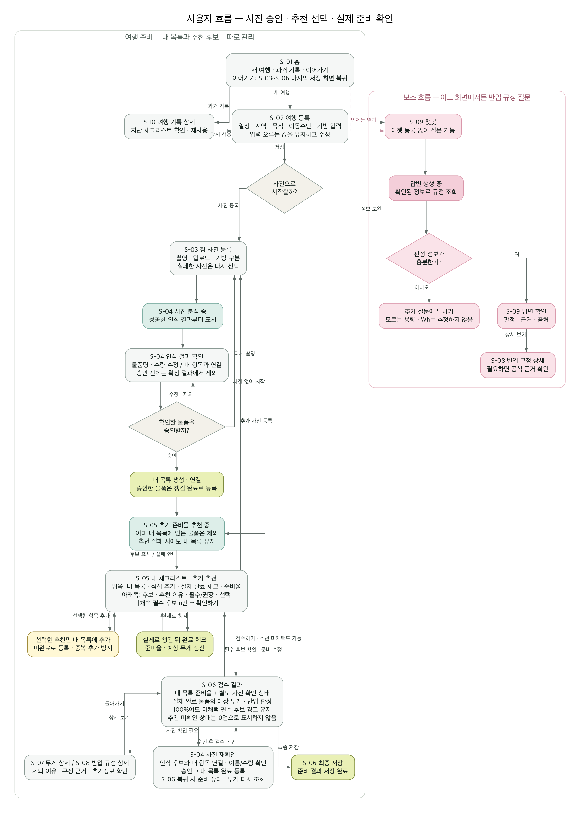

# 화면 흐름도 (Wireframe)

> 채점 기준: **"UI 와이어프레임(Figma) 완성도"**
> Peer Review: **"UI 와이어프레임 및 사용자 흐름(User Flow)이 직관적인가?"**

Use-Case는 [`02-use-case.md`](02-use-case.md)와 짝이다. 주 경로인
`S-03`·`S-04`·`S-05`는 `UC-03`·`UC-04`·`UC-05`와 번호가 그대로 맞는다.

## Figma

- 파일 링크: TBD
- 공유 설정: **"링크가 있는 모든 사용자 - 보기 가능"** 으로 열어 둔다.
  발표 때 교수·타 팀이 열 수 있어야 한다.

> **화면 10개를 모두 만든다.** 다만 아래 우선순위대로 쌓는다 —
> 시간이 모자랄 때 무엇을 뒤로 미룰지 미리 정해 두면 데모 당일에 흔들리지 않는다.

## 화면 목록

| ID | 화면 | 설명 | 관련 UC | 우선순위 |
| --- | --- | --- | --- | --- |
| S-01 | 홈 | 진행 중 여행 + 과거 여행 카드 목록 | UC-09 | **1차** |
| S-02 | 여행 등록 | 일정·지역·목적·이동수단·항공사·가방 입력 | UC-02 | **1차** |
| S-03 | **짐 사진 등록** | 다중 업로드·미리보기·삭제 | UC-03 | **1차** |
| S-04 | **인식 결과 · 승인** | 물품 후보·수량·신뢰도 확인 후 승인 | UC-04 | **1차** ★ |
| S-05 | **체크리스트** | 승인 물품 + AI 추천 부족분 + 추가·삭제·수정 | UC-05, UC-06 | **1차** ★ |
| S-06 | **검수 결과** | 준비 상태 + 예상 무게 + 반입 판정 통합 | UC-06, UC-07, UC-10 | **1차** ★ |
| S-07 | 무게 상세 | 품목별 기여도·제외 항목·한도 비교 | UC-10 | 2차 |
| S-08 | 반입 규정 상세 | 판정 근거·출처·추가정보 입력 | UC-07 | 2차 |
| S-09 | 챗봇 | 자연어 질의·추가 질문·근거 표시 | UC-08 | 3차 ★ |
| S-10 | 여행 기록 상세 | 과거 여행 조회·체크리스트 복사 | UC-09 | 3차 |

★ = AI 확장 지점이 있는 화면

**로그인 화면은 없다.** 회원·비회원을 구분하지 않기로 했다
([`01-service-plan.md`](01-service-plan.md)). 시드 사용자 한 명으로 고정한다.

### 사진이 체크리스트보다 먼저인 이유

**이 서비스의 약속이 *"사진만 찍으면 알려준다"* 이기 때문이다.**
페르소나 김지우의 대표 발언이 그것이고, 한 줄 정의도 *"가방 사진 한 장으로"* 다.

체크리스트를 먼저 만들게 하면 사용자는 사진에 닿기 전에 목록을 검토·확정해야
한다. 그 순간 이 서비스는 "사진으로 확인해 주는 도구"가 아니라 "체크리스트
앱에 사진 기능이 붙은 것"이 된다.

그래서 순서를 이렇게 잡는다.

    사진 → AI 인식 → 승인한 물품이 체크리스트에 등록
         → AI가 날씨·여행지를 보고 부족한 것만 추천해 덧붙임
         → 반입 규정으로 빼야 할 것을 표시

**AI 추천이 인식 결과를 입력으로 받는다.** 이미 가방에 있는 것을 다시
추천하지 않기 위해서다. 이것이 *"부족한 짐 추천"* 의 구현이다.

> 근거는 Notion 「기능 정의」 F-05 목적 —
> *"**이미지 인식을 통해 확인된 물품 체크리스트에 등록** 및 여행 조건에 맞는
> 준비물을 빠짐없이 제안한다."*
>
> 같은 문서 3절 「전체 서비스 흐름」은 체크리스트를 4단계 사진보다 앞인 3단계에
> 두고 있어 **원본 안에서 서로 어긋난다.** 팀은 F-05 목적을 따르기로 했다.
> Notion 3절과 페르소나 이용 흐름은 추후 이 순서로 맞춘다. (TBD)

### 우선순위를 나눈 기준

**화면 10개를 모두 만든다.** 다만 쌓는 순서를 정해 둔다.

| 순위 | 화면 | 기준 |
| --- | --- | --- |
| **1차** | S-01 ~ S-06 | **데모 주 경로.** 하나라도 빠지면 시연이 끊긴다. 홈 → 여행 등록 → 사진 → 인식 승인 → 체크리스트 → 검수 결과 |
| **2차** | S-07, S-08 | 깊이를 더한다. **1차의 요약을 눌러서 들어가는 화면**이라 없어도 흐름은 끊기지 않는다 |
| **3차** | S-09, S-10 | 주 경로 밖이다. 챗봇은 어디서든 열리는 별도 흐름이고, 기록 상세는 반복 사용자용이다 |

**1차 안에서도 S-04·S-05·S-06이 중심이다.** 셋 다 AI 확장 지점이 있어서
`202` → 폴링 → 렌더링을 화면으로 보여준다. 채점의 *"Mock API를 활용한 실제 데이터
바인딩 및 화면 시연"* 이 여기서 나온다.

> **시간이 모자라면 3차부터 버린다.** 10개를 얕게 만드는 것보다 1차 6개가
> 끊김 없이 도는 편이 점수가 높다 — PDF는 *"주요 웹 화면 1~2개 극소 구현"* 을
> 최소 기준으로 잡고 있다.

## 사용자 흐름 (User Flow)

**사용자 목표:** 여행자가 싸 놓은 짐을 촬영하면, 서비스가 물품을 인식해
체크리스트로 만들고 여행 조건에 맞는 부족분을 덧붙인 뒤, 준비 상태·예상 무게·
반입 가능 여부를 확인해 결과를 저장한다.

- 원본: [`images/03-userflow.puml`](images/03-userflow.puml) (PlantUML)
- 벡터: [`images/03-userflow.svg`](images/03-userflow.svg)
- 화면은 사각형, 선택은 마름모, 이동은 화살표로 구분한다.
- 관계선은 흐름을 빠르게 따라갈 수 있도록 수직·수평의 직각 형태로 배치한다.
- 청록색은 AI 처리 대기 화면(현재 Mock), 연두색은 사용자 목표 달성이다.

### 설계 검토 결과

| 검토 항목 | 기존 문제 | 반영한 설계 |
| --- | --- | --- |
| 순서 | 체크리스트를 먼저 확정하게 해서 *"사진 한 장으로"* 라는 약속과 멀어졌다 | 사진 → 인식 → 체크리스트 생성으로 되돌렸다 |
| 추천의 입력 | 여행 정보만 보고 전체 목록을 추천해 이미 챙긴 물건도 다시 제안했다 | 승인된 인식 결과를 입력에 넣어 **부족한 것만** 추천한다 |
| 회원 구분 | 로그인·비회원 분기가 주 경로를 갈랐다 | 구분을 없앴다. 모든 사용자가 같은 경로를 쓴다 |
| 사용자 관점 | API 경로·상태 코드·폴링이 화면 이동과 섞여 있었다 | 화면, 사용자 행동, 선택, 사용자가 보는 처리 상태만 남겼다 |
| 입력 오류 | 여행 등록 오류에서 흐름이 종료됐다 | 입력값을 유지한 채 오류 항목 수정으로 되돌아간다 |
| 재방문 | 진행 중 여행을 어디서 이어가는지 불명확했다 | S-01에서 마지막 저장 단계(S-03~S-06)로 복귀한다 |
| 사람의 확인 | 인식 결과 수정 후 승인 과정이 한 번만 표현됐다 | 수정·제외·직접 입력·재촬영을 반복한 뒤 승인한다 |
| 결과 활용 | 결과 화면 이후 행동이 최종 저장뿐이었다 | 무게 상세, 규정 근거, 결과 수정, 최종 저장을 선택한다 |

### 핵심 경로

    홈 → 여행 등록/재사용 → 짐 사진 등록 → 인식 결과 승인
       → 체크리스트 확인·보완 → 검수 결과 확인·수정 → 최종 저장

    챗봇(S-09)은 어느 화면에서든 열 수 있는 보조 흐름이다.
    주 경로를 가리지 않도록 별도 가지로 표시한다.

AI 호출의 `202 Accepted`와 폴링은 사용자 흐름이 아니라 시스템 동작이므로
[`06-api-spec.md`](06-api-spec.md)와 [`07-ai-ready.md`](07-ai-ready.md)에서
분리해 설명한다. 네 AI 작업이 하나의 엔드포인트와 `jobType`을 공유한다는
설계는 [ADR 0003](adr/0003-ai-job-endpoint.md)을 그대로 따른다.

## 화면별 상세

**로딩·빈 상태·오류 상태를 비워 두지 않는다.** AI 응답은 느리므로
(AI-Ready 원칙 3) "처리 중" 화면이 반드시 필요하다.

### S-01: 홈

| 항목 | 내용 |
| --- | --- |
| 목적 | 진행 중 여행을 이어서 하거나 새 여행을 시작한다 |
| 주요 요소 | 진행 중 여행 카드(여행지·기간·**준비 완료율**), 과거 여행 목록, `+ 새 여행` 버튼 |
| 호출 API | `GET /api/trips` → `200` |
| 로딩 상태 | 카드 자리에 스켈레톤 3개 |
| 빈 상태 | *"아직 등록한 여행이 없습니다"* + `첫 여행 만들기` 버튼 |
| 오류 상태 | *"목록을 불러오지 못했습니다"* + `다시 시도` |

### S-02: 여행 등록

| 항목 | 내용 |
| --- | --- |
| 목적 | 추천과 반입 판단에 쓸 여행 조건을 구조화해 입력받는다 |
| 주요 요소 | **필수** 출발일·귀국일·출발지·도착지·목적·이동수단 **항공 시 필수** 항공사·출발/도착 공항 **선택** 경유지·숙소·가방 크기·동행인·개인 특이사항 |
| 호출 API | `POST /api/trips` → `201 Created` + `Location` |
| 로딩 상태 | 저장 버튼 비활성 + 스피너 |
| 빈 상태 | — |
| 오류 상태 | 필드별 인라인 오류. **귀국일 < 출발일** 시 날짜칸 강조. 항공사 미입력 시 *"일반 기준만 적용되어 정확도가 낮아집니다"* 안내 |

### S-03: 짐 사진 등록

| 항목 | 내용 |
| --- | --- |
| 목적 | 물품 인식에 쓸 사진을 모은다. **이 서비스의 시작점이다** |
| 주요 요소 | 드래그&드롭 / 파일 선택(다중), 미리보기 썸네일·삭제, **기내용·위탁용 구분**, 촬영 가이드(*"물건을 펼쳐놓고 찍어 주세요"*), `분석 시작` |
| 호출 API | `POST /api/trips/{tripId}/photos` → `201` |
| 로딩 상태 | 파일별 업로드 진행률 |
| 빈 상태 | 점선 박스 + *"싸 놓은 짐을 찍어 올려 주세요"* |
| 오류 상태 | 형식·용량 초과 시 해당 썸네일에 표시하고 **나머지는 그대로 진행** |
| 특이 | 사진 없이 체크리스트만 만들고 싶은 사용자를 위해 `사진 없이 시작` 을 둔다. 이 경우 S-05에서 AI 추천만 받는다 |

### S-04: 인식 결과 · 승인 ★AI

| 항목 | 내용 |
| --- | --- |
| 목적 | AI가 찾은 물품을 사람이 확인하고 승인한다 |
| 주요 요소 | 사진 + 인식 물품 태그, 항목별 **이름·수량·신뢰도(높음/보통/낮음)**, 이름·수량 수정, `승인` / `이 물건 아님`, **"확인 필요" 묶음**, `사진에 없지만 챙겼어요` |
| 호출 API | `POST /api/ai-jobs` (`BAG_CHECK`) → `202` `GET /api/ai-jobs/{id}` → `200` **폴링** `GET /api/trips/{tripId}/detections` → `200` `PATCH /api/trips/{tripId}/detections/{detectionId}` → `200` **승인** |
| **로딩 상태** | **"사진을 분석하는 중"** + 사진별 진행. **화면을 벗어나도 결과는 저장된다**고 안내 |
| 빈 상태 | *"인식된 물품이 없습니다"* + `직접 입력` / `다시 촬영` |
| 오류 상태 | 일부 사진 실패 시 **성공한 것만 보여주고** 실패 사진은 재시도 버튼 |
| 특이 | **승인 전에는 다음 단계에 반영되지 않는다.** 미승인 개수를 항상 표시. 승인한 물품은 S-05 체크리스트 항목과 연결되고, 대응 항목이 없으면 S-06 `추가 물품` 으로 표시된다 |

### S-05: 체크리스트 ★AI

| 항목 | 내용 |
| --- | --- |
| 목적 | 승인된 물품으로 만들어진 체크리스트를 확인하고, AI가 덧붙인 부족분을 검토한다 |
| 주요 요소 | 카테고리 탭(서류·의류·전자기기·세면용품·의약품·현지 맞춤), 항목별 **출처 배지**(`사진에서 확인` / `AI 추천` / `규칙 필수` / `직접 추가`)·**필수/권장 배지**·수량·체크박스, **준비 완료율**, `+ 항목 추가`, 여행지 주의사항 |
| 호출 API | `POST /api/ai-jobs` (`PACKING_LIST`, **승인 물품 포함**) → `202` `GET /api/ai-jobs/{id}` → `200` **폴링** `GET` / `POST` / `PATCH` / `DELETE /api/trips/{tripId}/items` |
| **로딩 상태** | **"빠뜨린 물건을 찾는 중"** + 진행 표시. **폴링 중임을 사용자가 알 수 있어야 한다.** Mock이 즉시 답해도 이 상태를 거친다 |
| 빈 상태 | AI 실패 시 **사진에서 확인된 물품만** 보여주고 *"직접 추가해 주세요"* |
| 오류 상태 | *"추천을 만들지 못했습니다"* + `다시 시도`. **이미 등록된 항목은 지우지 않는다** |
| 특이 | 출발일이 **16일을 넘으면** *"실시간 예보가 아닌 계절 평균 기준입니다"* 를 표시한다. **AI 추천은 이미 사진에서 확인된 물품을 다시 제안하지 않는다** |

### S-06: 검수 결과 ★AI

| 항목 | 내용 |
| --- | --- |
| 목적 | 준비 상태·예상 무게·반입 여부를 한 화면에서 확인하고 최종 확정한다 |
| 주요 요소 | **① 준비 상태** — `준비 완료` / `확인 필요` / **`사진에서 미확인`** / `추가 물품` 4구역 **② 예상 무게** — `최소–대표–최대` 범위 막대, **신뢰도 배지**, 한도 대비 `여유·근접·초과 가능성`, 계산 제외 개수 **③ 반입 판정** — 물품별 6종 상태 배지 + 근거 한 줄 `최종 저장` 버튼 |
| 호출 API | `GET /api/trips/{tripId}/inspection` → `200` `POST /api/ai-jobs` (`WEIGHT_ESTIMATE`, `RULE_CHECK`) → `202` + 폴링 `PATCH /api/trips/{tripId}/items/{itemId}` → `200` |
| **로딩 상태** | 세 영역이 **각각 따로** 로딩된다. 무게가 아직이어도 준비 상태는 먼저 보인다 |
| 빈 상태 | 승인 물품이 없으면 *"먼저 사진을 검수해 주세요"* + S-03 이동 |
| 오류 상태 | 영역별로 표시. 무게 실패해도 반입 판정은 보인다 |
| **고정 문구** | *"사진 분석 결과는 가방 전체를 확인한 것이 아닙니다. 사진에서 확인되지 않은 물건은 직접 확인해 주세요."* *"예상 무게는 참고용 추정치입니다. 탑승 전 실제 저울로 측정하세요."* |

### S-07: 무게 상세

| 항목 | 내용 |
| --- | --- |
| 목적 | 무게가 왜 그렇게 나왔는지 보고 가방을 다시 구성한다 |
| 주요 요소 | 품목별 **기여도 막대**(무거운 순), 계산 제외 항목과 **이유**, 가방 빈 무게 입력, 항공사 한도 **실측값 입력은 이번 범위 밖이다 (TBD)** — 저장할 컬럼이 없다 |
| 호출 API | `GET /api/ai-jobs/{id}` → `200` |
| 로딩 상태 | 목록 스켈레톤 |
| 빈 상태 | *"계산할 물품이 없습니다"* |
| 오류 상태 | *"무게를 계산하지 못했습니다"* + 원인(가림·미식별·모델 불명) 표시 |

### S-08: 반입 규정 상세

| 항목 | 내용 |
| --- | --- |
| 목적 | 판정 근거를 보고 부족한 정보를 채운다 |
| 주요 요소 | 물품명·판정 배지, **판단 근거 문구**, **출처 링크와 확인 날짜**, 추가정보 입력(용량·Wh·날 길이·분리 여부), 권장 행동 |
| 호출 API | `GET /api/rules?transport=&keyword=` → `200` |
| 로딩 상태 | 스켈레톤 |
| 빈 상태 | *"해당 규정을 찾지 못했습니다"* + 항공사 확인 경로 |
| 오류 상태 | 판정 보류로 표시하고 **단정하지 않는다** |
| **고정 문구** | *"최종 반입 여부는 출발 당일 항공사와 보안검색기관의 판단을 따릅니다."* |

### S-09: 챗봇 ★AI

| 항목 | 내용 |
| --- | --- |
| 목적 | 자연어로 물어 반입 조건을 빠르게 확인한다 |
| 주요 요소 | 대화 목록, 입력창, **사진 첨부**, 추가 질문 말풍선(**한 번에 하나씩**), 판정 배지 + 근거 + 출처 |
| 호출 API | `POST /api/ai-jobs` (`RULE_CHECK`) → `202` + 폴링 |
| **로딩 상태** | 말풍선 자리에 **타이핑 인디케이터** |
| 빈 상태 | 예시 질문 3개 (*"20000mAh 보조배터리 기내 되나요?"* 등) |
| 오류 상태 | *"답변을 만들지 못했습니다"* + `다시 시도`. **대화 내용은 유지한다** |
| 특이 | 여행을 등록하지 않아도 쓸 수 있다. 주 경로 밖의 보조 흐름이다 |

### S-10: 여행 기록 상세

| 항목 | 내용 |
| --- | --- |
| 목적 | 지난 여행을 보고 다음 여행에 재사용한다 |
| 주요 요소 | 여행 요약, 최종 체크리스트, **사용하지 않은 물건**, `이 여행 다시 사용` |
| 호출 API | `GET /api/trips/{tripId}` → `200` |
| 로딩 상태 | 스켈레톤 |
| 빈 상태 | *"기록이 없습니다"* |
| 오류 상태 | *"불러오지 못했습니다"* + `다시 시도` |
| 특이 | **과거 반입 판정은 복사하지 않는다.** 최신 규정으로 다시 판정한다 |

## 와이어프레임 작성 시 지킬 것

1. **AI 화면(S-04·S-05·S-06·S-09)은 "처리 중" 상태를 반드시 그린다.**
   이 칸을 채운 팀과 아닌 팀은 발표에서 바로 갈린다.
2. **상태를 색으로만 구분하지 않는다.** 텍스트 라벨을 함께 둔다
   (Notion 기능 정의 9절 접근성 요구).
3. `사진에서 미확인`은 **`누락`이라고 쓰지 않는다.** 이 서비스의 핵심 원칙이다.
4. 무게는 **단일 값이 아니라 범위**로 그린다. 신뢰도 배지를 함께 둔다.
5. 고정 안내 문구(S-06·S-08)를 화면에 넣는다. 책임 범위 고지다.
6. **S-05의 출처 배지**(`사진에서 확인` / `AI 추천` / `규칙 필수` / `직접 추가`)를 반드시 그린다.
   사진에서 온 항목과 AI가 덧붙인 항목이 구분되어야 이 서비스의 설계가 보인다.
