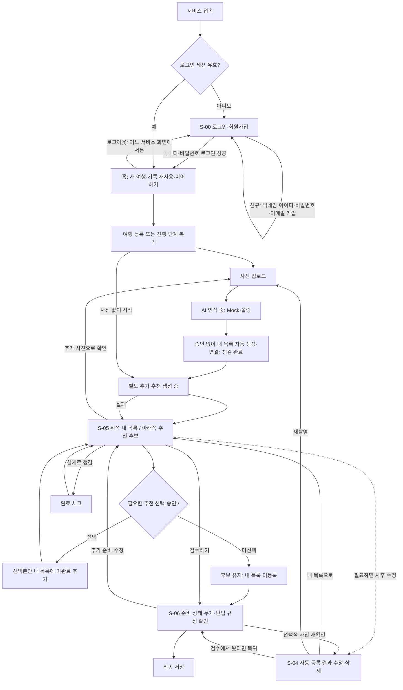

# 화면 흐름도 (Wireframe)

> 채점 기준: **"UI 와이어프레임(Figma) 완성도"**
> Peer Review: **"UI 와이어프레임 및 사용자 흐름(User Flow)이 직관적인가?"**

Use-Case는 [`02-use-case.md`](02-use-case.md)와 짝이다. 주 경로인
`S-03`·`S-04`·`S-05`는 `UC-03`·`UC-04`·`UC-05`와 번호가 그대로 맞는다.

## Figma

- 파일 링크: TBD
- 공유 설정: **"링크가 있는 모든 사용자 - 보기 가능"** 으로 열어 둔다.
  발표 때 교수·타 팀이 열 수 있어야 한다.

> **인증 포함 화면 11개를 설계·구현 대상으로 둔다.** 다만 아래 우선순위대로 쌓는다 —
> 시간이 모자랄 때 무엇을 뒤로 미룰지 미리 정해 두면 데모 당일에 흔들리지 않는다.

## 화면 목록

| ID | 화면 | 설명 | 관련 UC | 우선순위 |
| --- | --- | --- | --- | --- |
| S-00 | **로그인·회원가입** | `/login` 한 화면에서 전환. 가입 4개 필드, 로그인 아이디·비밀번호 | UC-01 | **1차·필수 진입** |
| S-01 | 홈 | 진행 중 여행 + 과거 여행 카드 목록 | UC-09 | **1차** |
| S-02 | 여행 등록 | 일정·지역·목적·이동수단·항공사·가방 입력 | UC-02 | **1차** |
| S-03 | **짐 사진 등록** | 다중 업로드·미리보기·삭제 | UC-03 | **1차** |
| S-04 | **인식 결과 · 사후 수정** | 인식 즉시 자동 등록된 물품·수량·신뢰도 표시, 선택적 사후 수정 | UC-04 | **1차** ★ |
| S-05 | **내 체크리스트 · AI 추천** | 위쪽 내 목록·아래쪽 추천 후보, 선택분 미완료 추가·실제 완료 체크 | UC-05, UC-06 | **1차** ★ |
| S-06 | **검수 결과** | 준비 상태 + 예상 무게 + 반입 판정 통합 | UC-06, UC-07, UC-10 | **1차** ★ |
| S-07 | 무게 상세 | 품목별 기여도·제외 항목·한도 비교 | UC-10 | 2차 |
| S-08 | 반입 규정 상세 | 판정 근거·출처·추가정보 입력 | UC-07 | 2차 |
| S-09 | 챗봇 | 자연어 질의·추가 질문·근거 표시 | UC-08 | 3차 ★ |
| S-10 | 여행 기록 상세 | 과거 여행 조회·체크리스트 복사 | UC-09 | 3차 |
| S-11 | **여행 일정 · 캘린더** | 월 달력에 여행 구간을 칠하고, 날짜별 항공편·숙소·관광 일정을 시간순으로 본다 | UC-02, UC-09 | 2차 |
| S-12 | **3D 가방 정리** | 가방 단면 위에 물품을 끌어 놓아 배치한다. 구역별 색으로 분류를 구분하고 `정리 초기화` 로 되돌린다 | UC-06 | 3차 |

★ = AI 확장 지점이 있는 화면

**모든 서비스 화면 S-01~S-10은 로그인 필수다.** 로그인·회원가입은 S-00 `/login`에서만
제공한다. 기존 `/login` 경로를 활용하고 기존 S-01~S-10 번호는 바꾸지 않는다.
세션 확인 중에는 서비스 데이터를 렌더하거나 API를 호출하지 않는다.
비로그인·만료 시 S-00으로 이동하고 로그인 성공 후 S-01에서 다시 시작한다.

### 내비게이션에 무엇을 넣고 무엇을 넣지 않나

왼쪽 내비게이션은 **여행 준비 · 일정 · 체크리스트 · 반입 규정 · 3D 가방 정리 · 설정** 이다.

**`S-09` 챗봇은 내비게이션에 넣지 않는다.** 오른쪽 아래 <b>플로팅 버튼</b>으로 띄운다.
챗봇은 어느 화면에서든 *"이거 가져가도 되나"* 를 묻는 보조 흐름이라, 내비게이션에 넣으면
화면을 떠나야 물어볼 수 있게 된다. `S-06` 검수 결과를 보다가 그 자리에서 묻는 것이
이 서비스의 사용 방식이다.

같은 이유로 챗봇은 여행 없이도 동작한다 — `RULE_CHECK` 만 `tripId` 가 nullable 이다
([`06-api-spec.md`](06-api-spec.md)).

### 사진이 체크리스트보다 먼저인 이유

**이 서비스의 약속이 *"사진만 찍으면 알려준다"* 이기 때문이다.**
페르소나 김지우의 대표 발언이 그것이고, 한 줄 정의도 *"가방 사진 한 장으로"* 다.

체크리스트를 먼저 만들게 하면 사용자는 사진에 닿기 전에 목록을 검토·확정해야
한다. 그 순간 이 서비스는 "사진으로 확인해 주는 도구"가 아니라 "체크리스트
앱에 사진 기능이 붙은 것"이 된다.

그래서 순서를 이렇게 잡는다.

    사진 → AI 인식 → 승인 없이 내 목록에 챙김 완료 자동 등록
         → 별도 추가 추천 → 필요한 후보 선택·승인 → 미완료로 추가
         → 실제 준비 완료 체크 → 무게·반입 규정 확인

**AI 추천은 실제 준비 완료 물품과 현재 내 목록을 구분해 입력으로 사용한다.**
이미 등록된 물품은 미완료라도 다시 추천하지 않는다. 동일 물품의 부족 수량 추천은 TBD다.

> 기준: [Notion 기능 정의 개정안](https://app.notion.com/p/3d0c2ab24ce881d9b06cc065c47b1eb7)
> 1절·F-04~F-06을 바탕으로, 최신 [사용자 결정](functional-specification.md)에 따라 사진 승인을 제거했다. 사진 인식은 자동 완료 등록, 추천 채택은 미완료 등록이다.

### 우선순위를 나눈 기준

**인증 포함 화면 11개를 설계·구현 대상으로 둔다.** 다만 쌓는 순서를 정해 둔다.

| 순위 | 화면 | 기준 |
| --- | --- | --- |
| **1차** | S-00 ~ S-06 | **데모 주 경로.** 하나라도 빠지면 시연이 끊긴다. 로그인 → 홈 → 여행 등록 → 사진 → 인식·자동 등록 → 체크리스트 → 검수 결과 |
| **2차** | S-07, S-08 | 깊이를 더한다. **1차의 요약을 눌러서 들어가는 화면**이라 없어도 흐름은 끊기지 않는다 |
| **3차** | S-09, S-10 | 주 경로 밖이다. 챗봇은 어디서든 열리는 별도 흐름이고, 기록 상세는 반복 사용자용이다 |

**1차 안에서도 S-04·S-05·S-06이 중심이다.** 셋 다 AI 확장 지점이 있어서
`202` → 폴링 → 렌더링을 화면으로 보여준다. 채점의 *"Mock API를 활용한 실제 데이터
바인딩 및 화면 시연"* 이 여기서 나온다.

> **시간이 모자라면 3차부터 버린다.** 11개를 얕게 만드는 것보다 필수 인증을 포함한 1차 7개가
> 끊김 없이 도는 편이 점수가 높다 — PDF는 *"주요 웹 화면 1~2개 극소 구현"* 을
> 최소 기준으로 잡고 있다.

## 사용자 흐름 (User Flow)

**사용자 목표:** 여행자가 싸 놓은 짐을 촬영하면, 서비스가 물품을 인식하고 사용자 승인 없이
내 목록에 완료로 자동 등록한다. 사용자는 아래쪽 추천 중 필요한 것만 미완료로 추가하고,
실제 준비 상태·예상 무게·반입 가능 여부를 확인해 결과를 저장한다.

### 개정 흐름 — 2026-09-03 기준

추천이 없어도, 하나도 선택하지 않아도 검수로 진행한다. 추천 실패는 기존 내 목록에
영향을 주지 않는다. 재방문은 마지막 진행 단계로 복귀하며 챗봇은 별도 보조 경로다.

### PNG — 개정 흐름 반영

> **2026-09-03 원본·PNG·SVG를 함께 갱신했다.** 위 Mermaid의 자동 등록·추천 채택·완료 경계와
> 아래 화면 상세의 필수 후보 경고·사진 재확인·재사용·챗봇 경로를 반영했다.

- 원본: [`images/03-userflow.puml`](images/03-userflow.puml) (PlantUML)
- 벡터: [`images/03-userflow.svg`](images/03-userflow.svg)
- 화면은 사각형, 선택은 마름모, 이동은 화살표로 구분한다.
- 관계선은 흐름을 빠르게 따라갈 수 있도록 수직·수평의 직각 형태로 배치한다.
- 청록색은 AI 처리 대기(현재 Mock), 노란색은 추천 채택, 연두색은 실제 준비 완료·저장이다.

### 설계 검토 결과

| 검토 항목 | 기존 문제 | 반영한 설계 |
| --- | --- | --- |
| 순서 | 체크리스트를 먼저 확정하게 해서 *"사진 한 장으로"* 라는 약속과 멀어졌다 | 사진 → 인식 → 승인 없이 내 목록 자동 완료 등록으로 정리했다 |
| 추천의 입력 | 여행 정보만 보고 전체 목록을 추천해 이미 챙긴 물건도 다시 제안했다 | 실제 준비 완료 물품과 현재 내 목록을 함께 고려해 중복을 제외한다 |
| 추천의 등록 | 추천 생성만으로 내 목록에 합쳤다 | 후보를 별도 표시하고 선택·승인분만 미완료로 등록한다 |
| 회원 구분 | 인증 제외·로그인 경로가 서로 다른 정책이었다 | S-00에서 가입·로그인하고 S-01~S-10 전체를 인증 뒤 이용하도록 통일했다 |
| 사용자 관점 | API 경로·상태 코드·폴링이 화면 이동과 섞여 있었다 | 화면, 사용자 행동, 선택, 사용자가 보는 처리 상태만 남겼다 |
| 입력 오류 | 여행 등록 오류에서 흐름이 종료됐다 | 입력값을 유지한 채 오류 항목 수정으로 되돌아간다 |
| 재방문 | 진행 중 여행을 어디서 이어가는지 불명확했다 | S-01에서 마지막 저장 단계(S-03~S-06)로 복귀한다 |
| 사람의 확인 | 사진 인식 결과를 승인해야 내 목록에 들어갔다 | 먼저 자동 등록하며 수정·삭제·재촬영은 이후 선택적으로 수행한다 |
| 결과 활용 | 결과 화면 이후 행동이 최종 저장뿐이었다 | 무게 상세, 규정 근거, 결과 수정, 최종 저장을 선택한다 |

### 핵심 경로

    로그인 → 홈 → 여행 등록/재사용 → 짐 사진 등록 → AI 인식
       → 승인 없이 내 목록 자동 완료 등록 → 별도 추천 검토·선택 → 실제 준비 관리
       → 검수 결과 확인·수정 → 최종 저장

    챗봇(S-09)은 로그인 후 어느 서비스 화면에서든 열 수 있는 보조 흐름이다.
    주 경로를 가리지 않도록 별도 가지로 표시한다.

AI 호출의 `202 Accepted`와 폴링은 사용자 흐름이 아니라 시스템 동작이므로
[`06-api-spec.md`](06-api-spec.md)와 [`07-ai-ready.md`](07-ai-ready.md)에서
분리해 설명한다. 네 AI 작업이 하나의 엔드포인트와 `jobType`을 공유한다는
설계는 [ADR 0003](adr/0003-ai-job-endpoint.md)을 그대로 따른다.

## 화면별 상세

**로딩·빈 상태·오류 상태를 비워 두지 않는다.** AI 응답은 느리므로
(AI-Ready 원칙 3) "처리 중" 화면이 반드시 필요하다.

### S-00: 로그인·회원가입

| 항목 | 내용 |
| --- | --- |
| 경로 | `/login`. 로그인 모드와 회원가입 모드를 한 화면에서 전환 |
| 로그인 | **아이디·비밀번호** 2개, `로그인`·`회원가입으로 이동`, 비밀번호 표시/숨기기 |
| 회원가입 | **닉네임·아이디·비밀번호·이메일** 4개, `가입하기`·`로그인으로 돌아가기`. 별도 비밀번호 확인·추가 프로필 입력 없음 |
| 검증 | 06의 길이·형식·아이디/이메일 중복 규칙. 닉네임은 중복 허용 |
| 호출 API | `GET /api/auth/session`으로 세션·CSRF 확인, `POST /api/auth/signup`, `POST /api/auth/login` |
| 성공 | 가입 후 아이디만 유지하고 비밀번호를 비운 뒤 로그인 모드로. 로그인 성공 후 세션·CSRF를 다시 조회하고 S-01로 |
| 로딩 | 인증 상태 조회 중 대기 화면. 제출 중 중복 요청 방지 |
| 오류 | 로그인 실패는 `아이디 또는 비밀번호를 확인해 주세요`. 가입 형식·중복은 해당 필드에서 수정. 네트워크 오류는 재시도 |
| 접근 제어 | 로그인 전 서비스 화면·챗봇·사진·작업 결과 모두 차단. 로그인된 사용자가 S-00에 오면 S-01로 이동 |

공통 헤더는 로그인 사용자 닉네임과 `로그아웃`을 표시한다. 로그아웃은
`POST /api/auth/logout` 성공 후 모든 사용자 데이터·사진 URL·AI 폴링을 정리하고 S-00으로
이동한다. 세션 만료도 동일하게 처리한다. CSRF 오류는 세션 상태를 재확인하고,
로그인이 유지되면 입력을 보존해 사용자가 다시 제출하도록 한다(06).

### S-01: 홈

| 항목 | 내용 |
| --- | --- |
| 목적 | 진행 중 여행을 이어서 하거나 새 여행을 시작한다 |
| 주요 요소 | 진행 중 여행 카드(여행지·기간·**준비 완료율**), 과거 여행 목록, `+ 새 여행` 버튼 |
| 호출 API | `GET /api/trips` → `200` |
| 로딩 상태 | 카드 자리에 스켈레톤 3개 |
| 빈 상태 | *"아직 등록한 여행이 없습니다"* + `첫 여행 만들기` 버튼 |
| 오류 상태 | *"목록을 불러오지 못했습니다"* + `다시 시도` |

### S-02: 여행 등록

| 항목 | 내용 |
| --- | --- |
| 목적 | 추천과 반입 판단에 쓸 여행 조건을 구조화해 입력받는다 |
| 주요 요소 | **필수** 출발일·귀국일·출발지·도착지·목적·이동수단 **항공 시 선택** 항공사·출발/도착 공항(없으면 일반 기준 안내) **선택** 경유지·숙소·가방 크기·동행인·개인 특이사항. 경유지·숙소·동행인의 개별 API·저장 규약은 TBD |
| 호출 API | `POST /api/trips` → `201 Created` + `Location` |
| 로딩 상태 | 저장 버튼 비활성 + 스피너 |
| 빈 상태 | — |
| 오류 상태 | 필드별 인라인 오류. **귀국일 < 출발일** 시 날짜칸 강조. 항공사 미입력 시 *"일반 기준만 적용되어 정확도가 낮아집니다"* 안내 |

### S-03: 짐 사진 등록

| 항목 | 내용 |
| --- | --- |
| 목적 | 물품 인식에 쓸 사진을 모은다. **이 서비스의 시작점이다** |
| 주요 요소 | 드래그&드롭 / 파일 선택(다중), 미리보기 썸네일·삭제, **기내용·위탁용 구분**, 촬영 가이드(*"물건을 펼쳐놓고 찍어 주세요"*), `분석 시작` |
| 호출 API | `POST /api/trips/{tripId}/photos` → `201` |
| 로딩 상태 | 파일별 업로드 진행률 |
| 빈 상태 | 점선 박스 + *"싸 놓은 짐을 찍어 올려 주세요"* |
| 오류 상태 | 형식·용량 초과 시 해당 썸네일에 표시하고 **나머지는 그대로 진행** |
| 특이 | `사진 없이 시작`은 S-05의 빈 내 목록과 별도 추천으로 이동한다. 후보를 선택·승인하거나 직접 추가할 때 내 목록이 생긴다 |

### S-04: 인식 결과 · 사후 수정 ★AI

| 항목 | 내용 |
| --- | --- |
| 목적 | 사진 인식 완료 즉시 자동 등록된 물품을 보여주고 필요할 때 사후 수정한다 |
| 주요 요소 | 사진·인식 태그, 이름·수량·신뢰도, `자동 등록됨` 표시, `수정 저장` / `목록에서 삭제`, `확인 필요` 묶음. 사진 승인 버튼은 두지 않는다 |
| 호출 API | `POST /api/ai-jobs` (`BAG_CHECK`) → `202` `GET /api/ai-jobs/{jobId}` → `200` 폴링 완료 후 `GET /api/trips/{tripId}/detections` · `GET /api/trips/{tripId}/items` 선택적 수정은 기존 detection PATCH, 삭제는 item DELETE |
| 로딩 상태 | `사진을 분석하고 목록에 등록하는 중`. 화면을 벗어나도 서버가 등록까지 처리한다 |
| 빈 상태 | `인식된 물품이 없습니다` + 직접 입력 / 재촬영. 항목을 임의 생성하지 않는다 |
| 오류 상태 | 일부 사진 실패 시 성공한 사진 물품은 자동 등록하고 실패 사진만 재시도. 등록 트랜잭션 실패를 완료로 표시하지 않는다 |
| 특이 | `BAG_CHECK COMPLETED` 전에 내 목록 생성·연결·PREPARED 등록을 끝낸다. 낮은 신뢰도·속성 부족도 등록은 유지하고 별도 안내한다. 자동 등록 후 곧바로 현재 목록을 제외한 추가 추천을 요청하고 S-05에 표시한다. S-04에서 사용자 입력을 기다리지 않는다 |
| 사후 수정 | 이름·수량·연결을 변경하면 같은 항목을 갱신한다. 여러 사진의 동일 물품 수량은 단순 합산하지 않는다. 자동 등록·중복 처리·사용자 수정 보존은 06을 따른다 |
| S-06에서 재확인 | 이미 등록된 항목과 인식 연결을 보여준다. 필요한 수정만 저장하고 `검수로 돌아가기`로 복귀한다. 승인해야 목록에 등록되는 단계가 아니다 |

### S-05: 체크리스트 ★AI

| 항목 | 내용 |
| --- | --- |
| 목적 | 내 목록의 실제 준비 상태를 관리하고 별도 추천 중 필요한 것만 채택한다 |
| 주요 요소 | **위쪽 내 체크리스트:** 카테고리·출처·필수/권장 배지·수량·실제 챙김 완료 체크·완료율·직접 추가 **아래쪽 AI 추천:** 후보별 이름·수량·이유·필수/권장·선택 UI와 `선택한 항목 추가` 버튼. 추가한 후보는 `추가됨` 표시로 재선택 방지 |
| 호출 API | `POST /api/ai-jobs` (`PACKING_LIST`, 실제 완료 물품 포함) → `202` `GET /api/ai-jobs/{jobId}` → `200` **폴링 및 후보 조회** `GET /api/trips/{tripId}/items` → 내 목록과 `recommendationJobId` `POST /api/trips/{tripId}/items` → 선택 후보 채택·직접 추가 `PATCH` / `DELETE /api/trips/{tripId}/items/{itemId}` |
| **로딩 상태** | 아래쪽에 **"추가 준비물을 추천하는 중"** 표시. 위쪽 내 목록은 계속 보이며 추천 생성만으로 완료율이 바뀌지 않는다 |
| 빈 상태 | 내 목록이 비면 사진 등록·직접 추가 안내. 추천이 비면 *"추가 추천이 없습니다"*. 추천 없이 검수 가능 |
| 오류 상태 | *"추천을 만들지 못했습니다"* + `다시 시도`. **이미 등록된 항목은 지우지 않는다** |
| 특이 | 추천 채택의 초기값은 **미완료**다. 실제 챙김 완료 체크와 별도 동작이다. `weatherSource`·`weatherAsOf`로 대체 기준과 데이터 시점을 표시한다. 이미 내 목록에 있는 물품은 미완료여도 다시 추천하지 않는다 |
| 필수 후보 경고 | `unacceptedRequiredCount > 0`이면 완료율과 함께 **`미채택 필수 후보 n건`**·`확인하기`를 표시한다. 누르면 아래 추천 영역의 필수 후보로 이동한다. 여권 등 RULE 후보도 포함하며 완료율 100%여도 경고를 유지한다. `null`이면 `필수 추천 확인 전`을 표시한다 |

### S-06: 검수 결과 ★AI

| 항목 | 내용 |
| --- | --- |
| 목적 | 준비 상태·예상 무게·반입 여부를 한 화면에서 확인하고 최종 확정한다 |
| 주요 요소 | **① 준비 상태** — 내 목록의 완료·미완료, 별도 사진 비교 배지(`확인됨` / `확인 필요` / `사진에서 미확인`) **② 예상 무게** — 실제 완료 항목의 `최소–대표–최대` 범위, 신뢰도·한도 대비 상태·계산 제외 이유 **③ 반입 판정** — 물품별 상태 배지 + 근거 한 줄 `최종 저장` 버튼 |
| 호출 API | `GET /api/trips/{tripId}/inspection` → `200` `POST /api/ai-jobs` (`WEIGHT_ESTIMATE`, `RULE_CHECK`) → `202` + 폴링 `PATCH /api/trips/{tripId}/items/{itemId}` → `200` |
| **로딩 상태** | 세 영역이 **각각 따로** 로딩된다. 무게가 아직이어도 준비 상태는 먼저 보인다 |
| 빈 상태 | 내 목록이 비면 사진 등록·직접 추가 안내. 완료 항목이 없으면 *"현재 챙김 완료된 물품이 없습니다"*. 사진이 없어도 직접 완료 확인한 물품으로 검수할 수 있다 |
| 변경 후 상태 | 완료 체크·수량·가방 정보 변경 후 무게를 재계산한다. 이전 결과와 현재 입력이 다르면 최신 무게처럼 표시하지 않는다. 미채택 추천은 완료율·무게에서 제외한다 |
| 필수 후보 경고 | `readiness.unacceptedRequiredCount`로 S-05와 같은 배지를 표시한다. `확인하기`는 S-05의 필수 추천 영역으로 이동한다. 경고는 완료율 계산·최종 저장을 막지 않으며 `null`은 `필수 추천 확인 전`으로 표시한다 |
| 사진 확인 경로 | `확인 필요` 항목의 `사진 확인` → 같은 여행의 S-04 → 이미 등록된 항목의 이름·수량·연결을 필요하면 수정 → `검수로 돌아가기`. 복귀 시 준비 상태·무게를 다시 조회한다. 재확인 여부가 자동 등록·완료율의 선행 조건이 되지 않는다 |
| 오류 상태 | 영역별로 표시. 무게 실패해도 반입 판정은 보인다 |
| **고정 문구** | *"사진 분석 결과는 가방 전체를 확인한 것이 아닙니다. 사진에서 확인되지 않은 물건은 직접 확인해 주세요."* *"예상 무게는 참고용 추정치입니다. 탑승 전 실제 저울로 측정하세요."* |

홈·S-05·S-06의 완료율은 06의 공통 규약으로 표시한다. 서버의 `0.889`는 모두 `89%`이며,
**내 목록의 준비율**로 표기한다. 미채택 필수 후보 경고는 이 비율과 별도로 유지한다.

### S-07: 무게 상세

| 항목 | 내용 |
| --- | --- |
| 목적 | 무게가 왜 그렇게 나왔는지 보고 가방을 다시 구성한다 |
| 주요 요소 | 품목별 **기여도 막대**(무거운 순), 계산 제외 항목과 **이유**, 가방 빈 무게 입력, 항공사 한도 **실측값 입력은 이번 범위 밖이다 (TBD)** — 저장할 컬럼이 없다 |
| 호출 API | `GET /api/ai-jobs/{jobId}` → `200` |
| 로딩 상태 | 목록 스켈레톤 |
| 빈 상태 | *"계산할 물품이 없습니다"* |
| 오류 상태 | *"무게를 계산하지 못했습니다"* + 원인(가림·미식별·모델 불명) 표시 |

### S-08: 반입 규정 상세

| 항목 | 내용 |
| --- | --- |
| 목적 | 판정 근거를 보고 부족한 정보를 채운다 |
| 주요 요소 | 물품명·판정 배지, **판단 근거 문구**, **출처 링크와 확인 날짜**, 추가정보 입력(용량·Wh·날 길이·분리 여부), 권장 행동 |
| 호출 API | `GET /api/rules?transport=&keyword=` → `200` |
| 로딩 상태 | 스켈레톤 |
| 빈 상태 | *"해당 규정을 찾지 못했습니다"* + 항공사 확인 경로 |
| 오류 상태 | 판정 보류로 표시하고 **단정하지 않는다** |
| **고정 문구** | *"최종 반입 여부는 출발 당일 항공사와 보안검색기관의 판단을 따릅니다."* |

### S-09: 챗봇 ★AI

| 항목 | 내용 |
| --- | --- |
| 목적 | 자연어로 물어 반입 조건을 빠르게 확인한다 |
| 주요 요소 | 대화 목록, 입력창, **사진 첨부**, 추가 질문 말풍선(**한 번에 하나씩**), 판정 배지 + 근거 + 출처 |
| 호출 API | `POST /api/ai-jobs` (`RULE_CHECK`) → `202` + 폴링 |
| **로딩 상태** | 말풍선 자리에 **타이핑 인디케이터** |
| 빈 상태 | 예시 질문 3개: *"20000mAh 보조배터리 기내 되나요?"*, *"120ml 화장품 기내 반입되나요?"*, *"날 길이 7cm 가위 기내 반입되나요?"* |
| 오류 상태 | *"답변을 만들지 못했습니다"* + `다시 시도`. **대화 내용은 유지한다** |
| 특이 | 로그인 후에는 여행을 등록하지 않아도 쓸 수 있다. 주 경로 밖의 보조 흐름이다 |

### S-10: 여행 기록 상세

| 항목 | 내용 |
| --- | --- |
| 목적 | 지난 여행을 보고 다음 여행에 재사용한다 |
| 주요 요소 | 여행 요약, 최종 체크리스트, **사용하지 않은 물건**, `이 여행 다시 사용` |
| 호출 API | `GET /api/trips/{tripId}` → `200` |
| 로딩 상태 | 스켈레톤 |
| 빈 상태 | *"기록이 없습니다"* |
| 오류 상태 | *"불러오지 못했습니다"* + `다시 시도` |
| 특이 | **과거 반입 판정은 복사하지 않는다.** 최신 규정으로 다시 판정한다 |

## 와이어프레임 작성 시 지킬 것

1. **AI 화면(S-04·S-05·S-06·S-09)은 "처리 중" 상태를 반드시 그린다.**
   이 칸을 채운 팀과 아닌 팀은 발표에서 바로 갈린다.
2. **상태를 색으로만 구분하지 않는다.** 텍스트 라벨을 함께 둔다
   (Notion 기능 정의 9절 접근성 요구).
3. `사진에서 미확인`은 **`누락`이라고 쓰지 않는다.** 이 서비스의 핵심 원칙이다.
4. 무게는 **단일 값이 아니라 범위**로 그린다. 신뢰도 배지를 함께 둔다.
5. 고정 안내 문구(S-06·S-08)를 화면에 넣는다. 책임 범위 고지다.
6. **S-05의 두 목록과 두 종류의 체크 UI를 구분한다.** 추천의 선택 체크와 내 목록의
   실제 완료 체크는 다른 동작이다. 출처 배지는 최초 등록 경로를 표시한다.
7. **이미 완료된 항목을 사진에서 못 찾았다고 미완료로 되돌리지 않는다.** 사진 확인 배지는
   별도 표시하고 준비 상태는 사용자의 실제 완료 확인을 따른다.
