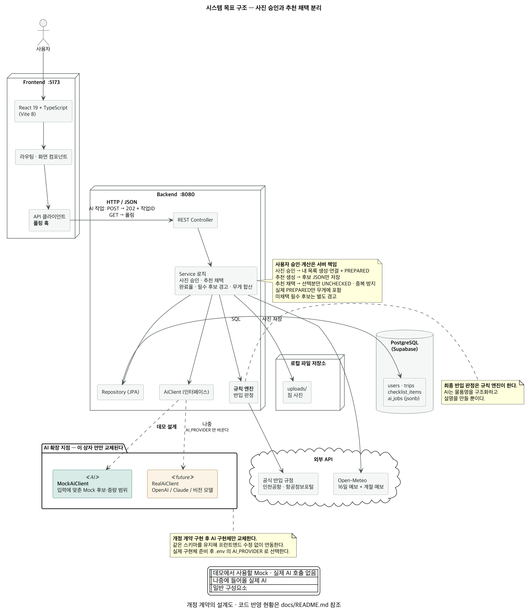

# 시스템 아키텍처

> 발표 3번 섹션 (4분): 전체 시스템 아키텍처 다이어그램
>
> 채점 기준: **"FE-BE-DB 전체 시스템 구조 다이어그램의 명확성"**

## 전체 구조

```text
┌─────────────────┐         ┌──────────────────────┐         ┌───────────────┐
│   Frontend      │  HTTP   │      Backend         │   SQL   │  PostgreSQL   │
│   React + TS    │ ──────▶ │      Spring Boot 4   │ ──────▶ │   Supabase    │
│                 │  JSON   │                      │         │   (Cloud)     │
│  - 라우팅        │ ◀────── │  - REST Controller   │ ◀────── │               │
│  - 화면 컴포넌트  │         │  - 서비스 로직        │         │  - 테이블      │
│  - API 클라이언트 │         │  - Repository        │         │  - 관계        │
└─────────────────┘         └──────────┬───────────┘         └───────────────┘
                                       │
                                       │ ◀─── AI 확장 지점 (데모는 Mock)
                                       ▼
                            ┌──────────────────────┐
                            │   Mock AI Service    │   지금: 입력에 맞춘 후보·범위
                            │   ─────────────────  │
                            │   나중: OpenAI /     │   나중: 같은 스키마로
                            │        Claude API    │        LLM 응답 반환
                            └──────────────────────┘
                                 이 상자 안만 교체된다
```

> **다이어그램의 핵심 메시지는 오른쪽 아래 상자다.** "AI가 들어올 자리를 미리
> 비워 뒀고, 그 상자 안만 교체하면 된다"는 것이 이 프로젝트의 주제다.
> 발표 때 이 한 장으로 설명할 수 있어야 한다.



> **2026-09-03 PNG·PUML·SVG에 승인·채택·계산 책임을 반영했다.** 그림은 시스템 목표 구조이며
> 구현 완료를 뜻하지 않는다. “이 상자 안만 교체”는 **개정 계약을 구현한 뒤 Mock을 실제 AI로
> 교체할 때**의 의미다. 기능 정의 자체가 달라질 때 API·화면까지 불변이라는 뜻은 아니다.

- 원본: [`images/04-architecture.puml`](images/04-architecture.puml) (PlantUML)
- 벡터: [`images/04-architecture.svg`](images/04-architecture.svg) — 발표 슬라이드용
- **고치는 법**: `.puml` 수정 후 [로컬 재생성 명령](images/README.md#저장소-다이어그램-재생성)으로
  PNG·SVG를 함께 만든다. **위 텍스트 다이어그램과 함께 고친다.**

## 기술 스택

| 계층 | 기술 | 선택 근거 |
| --- | --- | --- |
| Frontend | **React 19 · TypeScript · Vite 8**<br>React Router 7 | 팀원 사전 경험이 여기 있어 학습 시간을 아낀다. TS 타입이 `06-api-spec.md`의 응답 규격과 1:1로 대응해 **Interface First를 코드로 증명**한다. [ADR 0002](adr/0002-frontend-stack.md) |
| Backend | **Java 21 · Spring Boot 4.1.1 · Gradle 9.7**<br>Spring Data JPA · Validation · Lombok | Controller-Service-Repository 계층이 강제돼 5명이 짜도 구조가 흩어지지 않는다. JPA 엔터티가 ERD와 1:1로 대응한다. [ADR 0001](adr/0001-backend-stack.md) |
| Database | **PostgreSQL 17 (Supabase)**<br>로컬 개발용 Docker | 로컬 설치 없이 클라우드에서 즉시 생성, 팀원 전원이 같은 DB 공유. 스키마 시험용 로컬 DB는 [`database/README.md`](../database/README.md) |
| API 문서 | **springdoc-openapi (Swagger UI)** | `/swagger-ui.html`이 자동 생성된다. **2일차 산출물인 REST API 명세를 손으로 쓰지 않아도 된다** |
| AI 확장 지점 | **`AiClient` 인터페이스 + `MockAiClient`** | 인터넷이 끊겨도 데모가 돌아야 해서 Mock을 백엔드 안에 둔다. 인터페이스 하나에 구현 둘을 두면 **교체 지점이 코드로 드러난다.** 엔드포인트는 `POST /api/ai-jobs` 하나이고 `job_type`으로 구분한다 [ADR 0003](adr/0003-ai-job-endpoint.md) |
| 외부 API | **Open-Meteo** (16일 예보 + 계절 예보 7개월) | **API 키가 필요 없다.** 팀원 5명이 각자 발급받고 활성화를 기다릴 필요가 없다. AI가 아닌 일반 외부 연동이라 AI 확장 지점과 구분한다 |
| 형상관리 | GitHub (모노레포) | FE·BE·문서를 한 저장소에서 관리, 초대·클론 1회 |
| 설계 도구 | **PlantUML** (Use-Case · User Flow · 아키텍처)<br>Figma (와이어프레임) | `.puml` 원본이 저장소에 남아 다이어그램도 버전 관리된다 |

> **상태관리 라이브러리는 넣지 않았다.** 화면 10개 규모에서는 `useState` + Context로
> 충분하다. 필요해지면 그때 넣는다. (`Pinia`는 Vue 전용이라 React에서 동작하지 않는다)
>
> **HTTP 클라이언트도 넣지 않았다.** `fetch`로 충분하고, AI 폴링 훅은 직접 짜는 편이
> 발표에서 설명하기 좋다.

## AI-Ready 설계 적용 지점

### 사진 승인과 추천 채택의 책임

| 주체 | 처리 | 저장 위치 |
| --- | --- | --- |
| 이미지 AI (현재 Mock) | 사진에서 후보·수량·신뢰도를 반환 | `detected_objects`, 최초 `approved=false` |
| 서버 Service | 사진 승인 시 내 목록 생성·연결·완료 처리 | `checklist_items` + `item_detections` |
| 추천 AI (현재 Mock) | 여행 조건과 현재 내 목록을 고려해 후보·이유 제시 | `ai_jobs.output_payload` |
| 서버 Service | 선택·승인한 후보만 미완료로 등록, 반복 승인 방지 | `checklist_items`, 후보의 서버 필드 `acceptedItemId` |
| 서버 Service | 내 목록 기준 완료율, 실제 완료 항목 기준 무게 합산 | 내 목록에서 집계, 무게 결과는 `ai_jobs.output_payload` |

추천 생성 완료는 내 목록을 변경하지 않는다. 후보 저장과 사용자 채택 처리는 기존
`ai_jobs`·항목 추가 API를 사용한다(05·06·07). 화면·엔드포인트·테이블 수는 늘리지 않는다.

PDF가 제시한 4대 원칙을 이 구조가 각각 어디서 만족하는지 적는다.
**발표에서 가장 많이 질문받는 부분이다.**

| 원칙 | 이 프로젝트에서의 적용 | 확인 위치 |
| --- | --- | --- |
| **Interface First** | FE는 Mock API의 JSON 규격만 보고 개발한다. BE가 나중에 실제 LLM을 호출해도 응답 스키마가 같으므로 FE는 수정하지 않는다. | `06-api-spec.md` |
| **Structured Data** | AI 결과를 저장할 테이블에 JSON 컬럼과 메타데이터(모델명, 생성시각, 상태)를 미리 둔다. 변환 레이어가 필요 없다. | `05-erd.md` |
| **Asynchronous Pipeline** | AI 호출 엔드포인트는 즉시 `202 Accepted` + 작업 ID를 반환하고, 상태(`PENDING`/`COMPLETED`/`FAILED`)를 조회하는 엔드포인트를 따로 둔다. | `06-api-spec.md` |
| **Security & Config Isolation** | API 키·모델명·temperature를 코드가 아닌 `.env`에서 읽는다. 저장소에는 `.env.example`만 올린다. | `backend/.env.example` |

## 로컬 실행 구성

| 구성요소 | 포트 | 실행 방법 |
| --- | --- | --- |
| Frontend | 5173 | `cd frontend && npm run dev` |
| Backend | 8080 | `cd backend && ./gradlew bootRun` |
| Database | — | 클라우드. `backend/.env`의 `DATABASE_URL`로 접속 |

> 프런트엔드와 백엔드 포트가 다르므로 **CORS 설정이 필요하다.** 백엔드
> 스캐폴딩 때 개발용 origin(`http://localhost:5173`)을 허용해 둔다.
> 2일차에 FE-BE 연동이 막히는 가장 흔한 원인이다.

백엔드 개발환경 상세는 [`backend/SETUP.md`](../backend/SETUP.md)를 따른다.
DB 연결 전에는 `bootTestRun` + `test` 프로필로 Swagger를 확인할 수 있다.
이때 H2는 실행을 종료하면 사라지는 테스트 DB이며, Supabase 연동 검증은 별도로 한다.
일반 실행은 Supabase에 연결하며 JPA는 `validate`, SQL 자동 초기화는 `never`다.
서버별 연결 풀은 기본 최대 5개(`DB_POOL_SIZE`), 유휴 연결 최소 1개로 두고
JDBC 시각 처리는 UTC를 사용한다.
