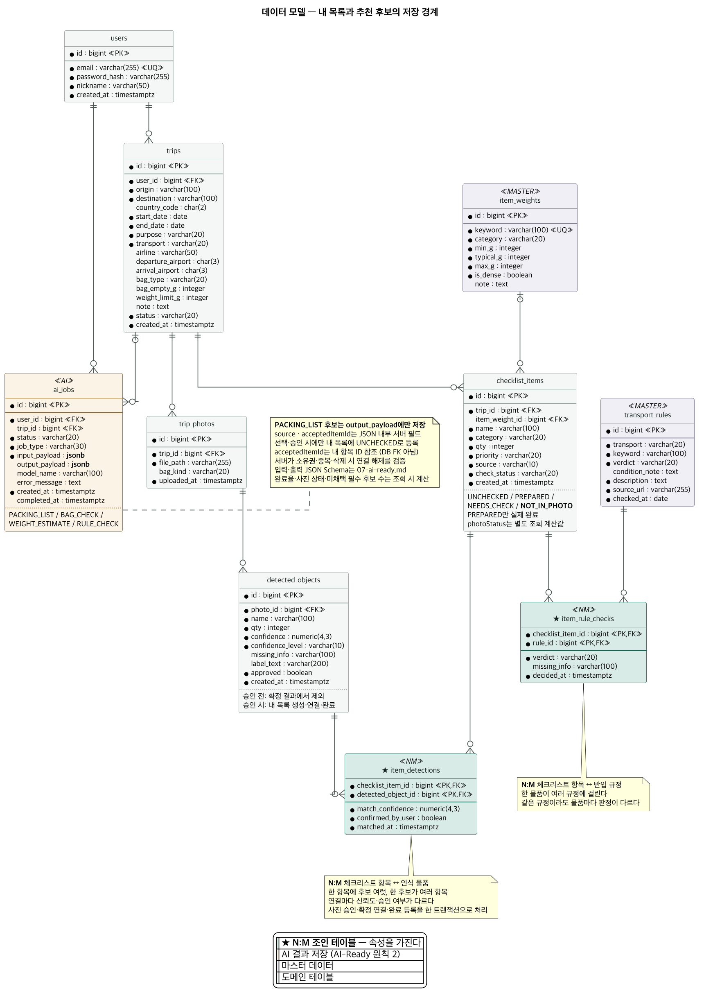

# 데이터 모델링 (ERD)

> 발표 3번 섹션: DB 데이터 모델링(ERD)
>
> 채점 기준: **"ERD 테이블 관계(1:N, N:M) 및 정규화 타당성"**
> Peer Review: **"데이터 모델링(ERD) 관계 및 정규화가 적절한가?"**

## ERD 다이어그램



- 원본: [`images/05-erd.puml`](images/05-erd.puml) (PlantUML)
- 벡터: [`images/05-erd.svg`](images/05-erd.svg) — 발표 슬라이드용
- dbdiagram.io 링크: TBD — 아래 DSL을 붙여 넣으면 즉시 생성된다

> 다이어그램은 **PlantUML로 그렸다.** Use-Case·User Flow·아키텍처와 같은 도구라
> `.puml` 원본이 저장소에 남고 버전 관리가 된다. dbdiagram.io는 DSL을 붙여 넣어
> 교차 확인하는 용도로 쓴다.

## 스키마 정의 (dbdiagram.io DSL)

```dbml
// ══════════════════════════════════════════════════════════
//  AI 여행가방 확인 플랫폼 — 데이터 모델
//  출처: Notion「기능 정의」v2 · docs/02-use-case.md UC-01~10
// ══════════════════════════════════════════════════════════

Table users {
  id            bigserial   [pk]
  email         varchar(255)[not null, unique]
  nickname      varchar(50) [not null]
  created_at    timestamptz [not null, default: `now()`]
}

// ── 여행 (UC-02 / F-02) ───────────────────────────────────
Table trips {
  id              bigserial   [pk]
  user_id         bigint      [not null, ref: > users.id]   // 1:N

  origin          varchar(100)[not null, note: '출발 도시. 이동수단과 무관하게 필수']
  destination     varchar(100)[not null, note: '도착 도시']
  country_code    char(2)     [note: 'ISO 3166-1 alpha-2']
  start_date      date        [not null]
  end_date        date        [not null]
  purpose         varchar(20) [not null, note: 'TOUR | BUSINESS | REST | STUDY']
  transport       varchar(20) [not null, note: 'FLIGHT | TRAIN | BUS | CAR']

  airline         varchar(50) [note: '항공 이용 시. 없으면 일반 기준만 적용된다']
  departure_airport char(3)   [note: 'IATA. 예: ICN']
  arrival_airport   char(3)

  bag_type        varchar(20) [note: 'CARRY_ON | MEDIUM | LARGE']
  bag_empty_g     integer     [note: '빈 가방 무게(g). F-10 산정식의 시작값']
  weight_limit_g  integer     [note: '항공사 허용 한도(g)']

  note            text        [note: '자유 메모. AI 가 해석한다']
  status          varchar(20) [not null, default: 'DRAFT', note: 'DRAFT | CONFIRMED | DONE']
  created_at      timestamptz [not null, default: `now()`]
}

// ── 체크리스트 항목 (UC-05·06 / F-05·F-06) ────────────────
Table checklist_items {
  id            bigserial   [pk]
  trip_id       bigint      [not null, ref: > trips.id]     // 1:N
  item_weight_id bigint     [ref: > item_weights.id, note: '무게 추정에 쓴다. 없을 수 있다']

  name          varchar(100)[not null]
  category      varchar(20) [not null, note: 'DOCUMENT | CLOTHING | ELECTRONIC | TOILETRY | MEDICINE | ETC']
  qty           integer     [not null, default: 1]
  priority      varchar(20) [not null, note: 'REQUIRED | RECOMMENDED']
  source        varchar(10) [not null, note: 'RULE | AI | USER — 누가 넣었는지']

  check_status  varchar(20) [not null, default: 'UNCHECKED',
                 note: 'UNCHECKED | PREPARED | NEEDS_CHECK | NOT_IN_PHOTO']

  created_at    timestamptz [not null, default: `now()`]

  indexes { (trip_id, category) }
}

// ── 짐 사진 (UC-03 / F-03) ────────────────────────────────
Table trip_photos {
  id            bigserial   [pk]
  trip_id       bigint      [not null, ref: > trips.id]     // 1:N
  file_path     varchar(255)[not null, note: 'UPLOAD_DIR 기준 상대 경로']
  bag_kind      varchar(20) [note: 'CABIN | CHECKED — 기내용/위탁용 구분 업로드']
  uploaded_at   timestamptz [not null, default: `now()`]
}

// ── 사진에서 인식된 물품 (UC-04 / F-04) ───────────────────
Table detected_objects {
  id            bigserial   [pk]
  photo_id      bigint      [not null, ref: > trip_photos.id]  // 1:N

  name          varchar(100)[not null, note: 'AI 가 제시한 후보명']
  qty           integer     [not null, default: 1]
  confidence    numeric(4,3)[not null, note: '0.000 ~ 1.000']
  confidence_level varchar(10)[not null, note: 'HIGH | MEDIUM | LOW — 화면 표시용']
  approved      boolean     [not null, default: false,
                 note: '사용자 승인 전에는 다음 단계에 반영하지 않는다']
  created_at    timestamptz [not null, default: `now()`]
}

// ══════════════════════════════════════════════════════════
//  ★ N:M 관계 1 — 체크리스트 항목 ↔ 인식 물품
//  명세 F-06: "동일 물품명 불일치 → 유사한 후보를 제시하고
//              사용자가 연결하도록 한다"
//  후보 여러 개 ↔ 항목 여러 개를 사람이 연결하는 구조다.
//  연결마다 신뢰도와 승인 여부가 붙으므로 조인 테이블에 속성이 있다.
// ══════════════════════════════════════════════════════════
Table item_detections {
  checklist_item_id  bigint  [ref: > checklist_items.id]
  detected_object_id bigint  [ref: > detected_objects.id]

  match_confidence   numeric(4,3)[not null, note: '이름·카테고리 매칭 점수']
  confirmed_by_user  boolean [not null, default: false]
  matched_at         timestamptz [not null, default: `now()`]

  indexes { (checklist_item_id, detected_object_id) [pk] }
}

// ── 반입 규정 마스터 (UC-07 / F-07) ───────────────────────
Table transport_rules {
  id            bigserial   [pk]
  transport     varchar(20) [not null, note: 'FLIGHT | TRAIN | BUS | CAR']
  keyword       varchar(100)[not null, note: '물품 키워드. 예: 보조배터리']
  verdict       varchar(20) [not null,
                 note: 'CABIN_OK | CHECKED_OK | CHECKED_FORBIDDEN | RESTRICTED | NEED_MORE_INFO | ASK_AIRLINE']
  condition_note text       [note: '판정 조건. 예: 100Wh 이하']
  description   text        [not null, note: '사용자에게 보여줄 근거 문구']
  source_url    varchar(255)[not null, note: '공식 출처. 인천공항·항공정보포털']
  checked_at    date        [not null, note: '규정 확인 날짜. 최신성 표시에 쓴다']

  indexes { (transport, keyword) }
}

// ══════════════════════════════════════════════════════════
//  ★ N:M 관계 2 — 체크리스트 항목 ↔ 반입 규정
//  한 물품이 여러 규정에 걸린다 (예: 화장품 = 액체 + 용량 제한)
//  한 규정이 여러 물품에 적용된다 (예: 액체 100ml 규정)
//  판정 결과와 확인 시각이 연결마다 다르므로 조인 테이블에 속성이 있다.
// ══════════════════════════════════════════════════════════
Table item_rule_checks {
  checklist_item_id bigint  [ref: > checklist_items.id]
  rule_id           bigint  [ref: > transport_rules.id]

  verdict           varchar(20)[not null, note: '이 물품에 대한 최종 판정']
  missing_info      varchar(100)[note: 'NEED_MORE_INFO 일 때 무엇이 부족한지']
  decided_at        timestamptz[not null, default: `now()`]

  indexes { (checklist_item_id, rule_id) [pk] }
}

// ── 품목별 무게 마스터 (UC-10 / F-10) ─────────────────────
Table item_weights {
  id            bigserial   [pk]
  keyword       varchar(100)[not null, unique]
  category      varchar(20) [not null]
  min_g         integer     [not null]
  typical_g     integer     [not null]
  max_g         integer     [not null]
  is_dense      boolean     [not null, default: false,
                 note: '책·금속·배터리·액체. 오차가 커서 실측을 먼저 요청한다']
  note          text
}

// ── AI 작업 (UC-04·05·07·08·10 전부) ──────────────────────
// AI-Ready 원칙 2 (Structured Data).
// 지금은 Mock 이 채우고, 나중에 LLM·비전 모델이 같은 자리를 채운다.
Table ai_jobs {
  id            bigserial   [pk]
  user_id       bigint      [not null, ref: > users.id]     // 1:N
  trip_id       bigint      [ref: > trips.id,
                 note: 'nullable — 반입 규정 확인(UC-07)은 여행 없이도 물어볼 수 있다']

  status        varchar(20) [not null, default: 'PENDING', note: 'PENDING | COMPLETED | FAILED']
  job_type      varchar(30) [not null,
                 note: 'PACKING_LIST | BAG_CHECK | WEIGHT_ESTIMATE | RULE_CHECK']

  input_payload  jsonb      [not null, note: 'AI 에 넘긴 입력. 스키마는 07-ai-ready.md']
  output_payload jsonb      [note: 'AI 가 돌려준 결과. PENDING 이면 null']

  model_name    varchar(100)[note: 'Mock 이면 "mock", 나중엔 실제 모델명']
  error_message text        [note: 'FAILED 일 때만 채운다']

  created_at    timestamptz [not null, default: `now()`]
  completed_at  timestamptz

  indexes {
    (user_id, created_at)
    (status)
    (trip_id, job_type)
  }
}
```

## 테이블 관계

| 관계 | 유형 | 설명 |
| --- | --- | --- |
| `users` → `trips` | 1:N | 사용자 한 명이 여러 여행을 만든다 |
| `users` → `ai_jobs` | 1:N | 사용자 한 명이 여러 AI 작업을 만든다 |
| `trips` → `checklist_items` | 1:N | 여행 하나에 준비물 여러 개 |
| `trips` → `trip_photos` | 1:N | 여행 하나에 짐 사진 여러 장 |
| `trips` → `ai_jobs` | 1:N | 여행 하나에 AI 작업 여러 개 (**nullable** — UC-07 반입 규정 확인은 여행 없이도 물어볼 수 있다) |
| `trip_photos` → `detected_objects` | 1:N | 사진 한 장에서 물품 여러 개 인식 |
| `item_weights` → `checklist_items` | 1:N | 무게 마스터 하나가 여러 항목에 쓰인다 |
| **`checklist_items` ↔ `detected_objects`** | **N:M** | `item_detections` 경유. **아래 참조** |
| **`checklist_items` ↔ `transport_rules`** | **N:M** | `item_rule_checks` 경유. **아래 참조** |

### N:M 검토 결과

**두 개를 찾았고, 둘 다 명세에서 그대로 나온다. 억지로 만든 것이 아니다.**

**① `checklist_items` ↔ `detected_objects` (`item_detections`)**

명세 F-06 예외 처리가 이 관계를 요구한다.

> *"동일 물품명 불일치 → 유사한 후보를 제시하고 **사용자가 연결하도록** 한다"*
> *"중복 탐지 → 동일 물건 후보를 **묶어** 사용자가 수량을 확정하도록 한다"*

- 사진 3장에 같은 충전기가 찍히면 **인식 결과 3개가 체크리스트 항목 1개**에 붙는다
- "화장품"이라는 항목 하나에 **여러 후보**(로션·선크림·파운데이션)가 매칭될 수 있다
- 반대로 인식된 "검정 파우치" 하나가 **여러 항목의 후보**가 될 수 있다

`detected_objects.matched_item_id` 같은 단일 FK로는 이 요구를 표현할 수 없다.

**② `checklist_items` ↔ `transport_rules` (`item_rule_checks`)**

한 물품이 여러 규정에 동시에 걸린다.

- 200ml 화장품 = `액체류 100ml 초과` + `총량 1L 제한` 두 규정
- 보조배터리 = `기내 전용` + `100Wh 초과 시 승인 필요` 두 규정

반대로 `액체 100ml` 규정 하나가 화장품·샴푸·선크림 여러 항목에 적용된다.

### 조인 테이블에 속성이 붙는다

**두 조인 테이블 모두 단순 연결이 아니라 속성을 가진다.** 이것이 이 설계의 핵심이다.

| 조인 테이블 | 속성 | 왜 필요한가 |
| --- | --- | --- |
| `item_detections` | `match_confidence`<br>`confirmed_by_user` | **AI 가 제안한 연결과 사람이 승인한 연결을 구분한다.** 명세 9.2 수용 기준: *"사진 분석 결과는 사용자가 승인하기 전 최종 준비 상태에 반영되지 않아야 한다"* |
| `item_rule_checks` | `verdict`<br>`missing_info` | 같은 규정이라도 **물품마다 판정이 다르다.** 100ml 화장품은 통과, 200ml는 위탁 |

**연결 자체가 정보를 갖는 관계**이므로 조인 테이블이 필요하다. 단순 다대다 매핑이었다면
FK 두 개만으로 끝났을 것이다.

## 정규화 검토

| 항목 | 확인 | 비고 |
| --- | --- | --- |
| **1NF** — 모든 컬럼이 원자값인가 | ✅ | 반복 그룹 없음. `jsonb` 두 컬럼은 **의도적 예외**로 아래 근거 참조 |
| **2NF** — 부분 함수 종속이 없는가 | ✅ | 복합 PK를 쓰는 두 조인 테이블(`item_detections`·`item_rule_checks`)의 비키 속성이 PK **전체**에 종속된다. `match_confidence`는 (항목, 인식결과) 쌍에 대해서만 정해지고, 어느 한쪽만으로는 정해지지 않는다 |
| **3NF** — 이행 함수 종속이 없는가 | ✅ | 무게 정보를 `checklist_items`에 직접 넣지 않고 `item_weights`로 분리했다. 넣었다면 `id → keyword → typical_g` 이행 종속이 생긴다 |
| **의도적 비정규화** | 2건 | `ai_jobs`의 `jsonb` 2개 · `detected_objects.confidence_level` |

### `jsonb` 컬럼을 쓰는 근거

`ai_jobs.input_payload`와 `output_payload`를 정규화된 컬럼으로 쪼개지 않은 것은
설계 실수가 아니라 **의도적 선택**이다.

- AI의 출력 형태는 프롬프트에 따라 달라진다. 컬럼으로 고정하면 프롬프트를
  바꿀 때마다 마이그레이션이 필요하다.
- **`job_type`이 4종이고 각각 출력 모양이 다르다.** 컬럼으로 펴면 대부분이 null인
  넓은 테이블이 된다.
- PDF의 **Structured Data** 원칙이 요구하는 것이 정확히 이것이다 —
  "AI가 읽고 이해하기 쉬운 JSON 규격을 사전에 반영하여 바로 DB에 저장하거나
  FE에 전달할 수 있도록 하여 데이터 변환 레이어의 부담을 최소화"
- 대신 **JSON의 내부 구조는 `07-ai-ready.md`에 JSON Schema로 고정**한다.
  스키마 없는 자유 형식 JSON이 아니다.

### `confidence_level`을 따로 두는 근거

`detected_objects.confidence`(숫자)에서 `confidence_level`(HIGH/MEDIUM/LOW)이
계산되므로 엄밀히는 이행 종속이다. **그럼에도 컬럼으로 둔다.**

- 경계값(예: 0.8 / 0.5)이 **운영 중에 바뀔 수 있다.** 그때 과거 판정을 소급해서
  바꾸면 안 된다 — 사용자가 그 시점의 표시를 보고 승인했기 때문이다
- 명세 9.1: *"원본 사진, 인식 결과, 사용자 수정, 최종 상태를 **분리 저장**"*

> 발표 Q&A에서 "왜 정규화하지 않았느냐"는 질문이 나오면 위 두 절로 답하면 된다.
> **정규화를 몰라서 안 한 것과 알고 안 한 것은 다르다.**

## 실행 스크립트

확정된 스키마는 [`database/schema.sql`](../database/schema.sql)에 SQL로 옮긴다.
데모용 초기 데이터는 [`database/seed.sql`](../database/seed.sql)에 둔다.

**이 문서의 DSL과 `schema.sql`은 짝이다. 한쪽만 고치지 않는다.**
