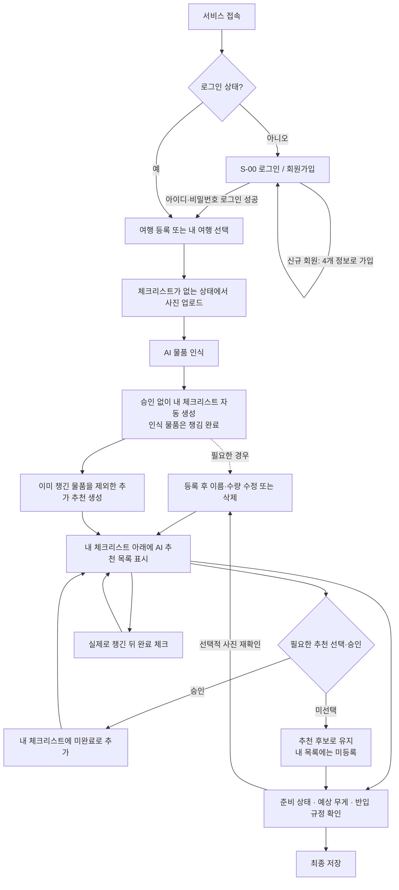

# 기능정의서 — 로그인 필수 여행가방 확인 서비스

> **2026-09-03 로그인 필수·사진 자동 등록 최종 결정 반영**
> 로그인한 사용자의 사진 인식 물품은 승인 없이 자동 등록하고, 추가 추천만 직접 선택·승인한다.

이 문서는 사용자가 붙여넣은 [개인 Notion 기능 정의 개정안](https://app.notion.com/p/3d0c2ab24ce881d9b06cc065c47b1eb7)을
저장소 문서로 옮기고 **서비스 이용 전 로그인 필수** 결정을 반영한 기능 정의다.
기존 [팀 Notion 개정안](https://app.notion.com/p/3d0a9fc8c93880348410cc06f2eb5e50)의 동기화 여부와 별개로,
이번 로그인 결정과 **사진 자동 등록·추천만 승인** 결정을 저장소의 개정 기준으로 사용한다. Notion 원문을 수정한 것은 아니다.

- **회원가입:** 닉네임·아이디·비밀번호·이메일 4개만 입력한다. 별도 비밀번호 확인 필드는 두지 않는다.
- **로그인:** 아이디·비밀번호로 인증한다. 회원가입 성공 후 로그인 화면으로 이동해 직접 로그인한다.
- **공개 범위:** 로그인·회원가입 화면과 해당 인증 처리만 제공한다. 홈·여행·사진·추천·규정·챗봇·기록은 모두 로그인 후 이용한다.
- **개인 자료:** 여행·물품·사진·AI 작업은 로그인한 본인 소유 자료만 조회·수정한다. 이메일이 같아 보이거나 URL을 알아도 다른 사용자 자료를 열 수 없다.
- **규모:** UC-01~UC-10은 유지한다. 공통 인증 화면 S-00을 추가해 총 11개 화면이며 1차는 S-00~S-06이다.
- **설계와 구현:** `AI_PROVIDER=openai`에서는 사진 인식·준비물 추천·여행 검수의 규정 구조화/설명이 실제 AI다. 여행 없는 S-09 챗봇과 무게 범위는 Mock을 유지하며, 판정·합산은 항상 서버 규칙이다.

기능·사용자 흐름은 이 문서, HTTP·인증 계약은 [06](06-api-spec.md), 저장 구조는
[05](05-erd.md), AI JSON은 [07](07-ai-ready.md)을 함께 따른다.
원문에 있는 가족·단체·실측값·일괄 처리·변경 이력 등 확장 요구를 보존하되,
현재 데모 범위와 저장/API 미정 사항은 [01](01-service-plan.md)과 8절을 우선한다.

## 1. 핵심 사용 흐름

**회원가입(최초 1회) → 로그인 → 여행 등록 → 사진 업로드 → AI 물품 인식 → 사용자 승인 없이 내 체크리스트에 ‘챙김 완료’로 자동 등록 → 아래에 별도 AI 추천 표시 → 필요한 추천 선택·승인 → 내 체크리스트에 ‘미완료’로 추가**

### 두 목록의 차이

| 구분 | 내 체크리스트 | AI 추천 목록 |
| --- | --- | --- |
| 의미 | 사진에서 자동 등록된 물품과 사용자가 챙기기로 선택한 물품 | 여행 조건에 따라 추가로 챙길지 검토할 후보 |
| 초기 내용 | 사진에서 AI가 인식한 물품 | 이미 등록된 물품을 제외한 추가 추천 |
| 표시 위치 | 화면 위쪽 | 내 체크리스트 아래쪽 |
| 등록 시점 | 사진 인식 완료 즉시 자동 등록 또는 추천 선택·승인 시 | 추천 생성 시 후보로 표시 |
| 준비 완료율 | 포함 | 승인 전에는 제외 |

**‘추천 승인’은 챙길 목록에 넣겠다는 뜻이며, 실제로 챙겼다는 뜻은 아니다.** 사진에서 인식한 물품은 승인 없이 챙김 완료로 자동 등록하고, 추천에서 선택한 물품은 미완료로 등록한다.

### 사용 예시

사진에서 AI가 **충전기·상의·보조배터리**를 인식했다. 사용자 확인·승인 없이 세 물품을 즉시 내 체크리스트에 등록한다.

**위쪽 — 내 체크리스트**

- [x]  충전기 · 사진에서 확인
- [x]  상의 · 사진에서 확인
- [x]  보조배터리 · 사진에서 확인

**아래쪽 — AI 추천 목록**

| 추천 후보 | 추천 이유 | 사용자 동작 |
| --- | --- | --- |
| 여행용 어댑터 | 여행지의 콘센트 형태 확인 필요 | 선택 후 내 체크리스트에 추가 |
| 세면도구 | 숙소 제공 여부에 따라 준비 검토 | 선택 후 내 체크리스트에 추가 |

사용자가 어댑터만 선택·승인하면 위쪽 목록에 **미완료 어댑터**가 추가된다. 세면도구는 승인 전 추천 후보로 남으며, 내 체크리스트와 준비 완료율에 포함되지 않는다. 추가한 어댑터는 아래 추천 목록에서 제거하거나 ‘추가됨’으로 표시하여 중복 등록을 막는다.

### 지켜야 할 처리 순서

1. 로그인과 여행 등록을 마쳤다면 체크리스트가 없어도 사진 업로드와 분석을 시작할 수 있다.
2. AI가 사진 속 물품명·수량·신뢰도를 반환한다. 사용자 승인 화면을 등록 조건으로 두지 않는다.
3. 서버가 인식 완료와 함께 내 체크리스트를 자동 생성한다. 이미 목록이 있으면 동일 물품과 연결하고 없는 항목을 추가한다.
4. 사진 인식 물품은 ‘챙김 완료’로 자동 표시한다. 낮은 신뢰도·속성 부족은 별도 안내하되 등록을 막지 않는다. 사용자는 등록 후 이름·수량·오인식을 수정·삭제할 수 있다.
5. 자동 등록이 끝난 내 목록을 읽고 이미 등록된 물품을 제외해, 여행 조건상 추가로 필요할 물품을 추천한다. 사진에 없다는 사실만으로 필수품이라고 판단하지 않는다.
6. 추가 후보는 내 체크리스트 아래의 별도 추천 영역에 표시한다. 생성만으로 내 체크리스트에 등록하지 않는다.
7. 사용자가 필요한 후보만 선택·승인하면 내 체크리스트에 미완료 상태로 추가한다.
8. 사용자가 실제로 챙기거나 추가 사진에서 확인한 뒤 해당 항목을 완료 처리한다.

> 사진 인식 물품에는 사전 승인 단계가 없다. 등록 후 수정은 선택 사항이다. 승인 단계는 추가 추천을 내 목록에 넣을 때만 적용한다. 사진에서 찾지 못했다는 이유만으로 실제 누락을 확정하지 않는다.
>

### 흐름도

---

## 2. 서비스 개요와 주요 사용자

**서비스 목적:** 로그인한 사용자가 촬영한 짐 사진에서 물품을 인식하고, 인식된 물품을 사용자 승인 없이 내 체크리스트에 챙김 완료로 자동 등록한다. 여행 조건에 맞는 추가 준비물은 아래의 별도 AI 추천 목록에 제시하고, 사용자가 필요한 항목만 선택·승인해 자신의 체크리스트에 추가한다. 이후 준비 상태, 반입 규정, 예상 무게를 확인한다.

**사용자 역할:** 자동 등록된 사진 물품의 물품명·수량을 필요할 때 사후 수정하고, 추가 추천 중 필요한 항목을 선택한다. 추천을 목록에 추가하는 동작과 실제 챙김 완료 처리를 구분하며, 보이지 않는 속성과 실측값을 보완하고 최종 상태를 확정한다.

**핵심 원칙:** 사진에서 확인한 물품, AI 추천 후보, 사용자가 채택한 준비물을 구분한다. 불확실성을 공개하고, 사진 미인식 항목을 실제 누락으로 단정하지 않는다. 무게는 범위와 신뢰도를 함께 제공한다.

### 페르소나의 주요 이용 흐름

**일반 항공 여행객:** 회원가입·로그인 → 여행 등록 → 짐 사진 등록 → 인식 완료 즉시 내 체크리스트 자동 생성 → 아래쪽 AI 추천에서 필요한 항목 선택·승인 → 추가 준비 및 완료 체크 → 반입 규정 확인 → 최종 저장.

**장기 여행자:** 회원가입·로그인 → 장기 일정 등록 → 여러 장의 짐 사진 등록 → 인식 물품·수량으로 내 체크리스트 자동 생성 → 장기 체류에 필요한 추가 추천 검토·승인 → 추가 준비 → 가방·고밀도 물품 정보 입력 → 예상 무게 확인 → 가방 재구성.

가족·단체 페르소나는 기존 확장 범위를 유지한다. 향후 동일한 사진 기반 흐름을 적용할 때도 추천 후보와 실제 준비 목록을 구분한다.

### 핵심 페르소나 요약

| 구분 | 페르소나 1 | 페르소나 2 | 페르소나 3 | 페르소나 4 |
| --- | --- | --- | --- | --- |
| 유형 | 일반 항공 여행객 | 가족여행 준비자 | 장기 여행자 | 단체여행 총무 |
| 이름 | 김지우 | 박서연 | 이준호 | 최민아 |
| 연령대 | 20대 후반 | 30대 후반 | 30대 초반 | 20대 중반 |
| 여행 형태 | 연 2~3회 개인·친구 여행 | 자녀를 동반한 가족여행 | 유학·출장·한 달 살기 | 친구·동호회 단체여행 |
| 핵심 목표 | 빠르고 빠짐없이 짐 준비 | 가족 구성원별 준비물 관리 | 많은 짐의 무게와 반입 규정 확인 | 구성원별 준비 현황 통합 |
| 주요 불편 | 준비물 누락, 액체·배터리 규정 혼란 | 아이 물품 누락, 담당자 혼선 | 초과 중량과 추가 요금 걱정 | 중복 준비와 공동물품 누락 |
| 핵심 기능 | 맞춤 체크리스트, 사진 검수 | 구성원별 체크리스트 | 예상 무게, 반입 규정 | 공동 체크리스트, 역할 분담 |

---

### 페르소나 1 — 일반 항공 여행객

| 항목 | 내용 |
| --- | --- |
| 이름 | 김지우 |
| 연령·직업 | 28세, 직장인 |
| 여행 특성 | 연 2~3회 해외여행을 하며 주로 친구와 3~5일 정도 여행한다. |
| 디지털 활용도 | 모바일 앱과 온라인 예약 서비스에 익숙하며 복잡한 입력 과정은 선호하지 않는다. |
| 행동 특성 | 출발 1~2일 전에 짐을 몰아서 준비하고 인터넷이나 과거 메모를 참고한다. |
| 주요 목표 | 짧은 시간 안에 필요한 물품을 빠짐없이 준비하고 공항에서 문제가 생기지 않도록 확인하고 싶다. |
| 불편 사항 | 충전기·어댑터·상비약 등을 자주 빠뜨리고, 액체류나 보조배터리의 반입 규정을 매번 다시 검색한다. |
| 필요한 기능 | 여행정보 기반 체크리스트, 사진 속 물품 자동 인식, 사진에서 미확인된 준비물 안내, 물품별 기내·위탁 반입 상태. |
| 중요 출력 | 준비 완료율, 사진에서 미확인된 항목, 추가정보 필요 물품, 기내·위탁 가능 여부. |
| 기대 효과 | 준비 시간을 줄이고 공항 보안검색 과정에서 발생할 수 있는 문제를 예방한다. |
| 대표 발언 | “사진만 찍으면 빠뜨린 물건과 기내에 가져갈 수 없는 물건을 한 번에 알려줬으면 좋겠어요.” |

#### 주요 이용 흐름

`회원가입·로그인 → 여행 등록 → 사진 인식·챙김 완료 자동 등록 → 별도 추천 선택·미완료 추가 → 실제 준비 확인 → 반입 규정 확인 → 최종 저장`

---

### 페르소나 2 — 가족여행 준비자

| 항목 | 내용 |
| --- | --- |
| 이름 | 박서연 |
| 연령·직업 | 38세, 회사원·육아 중 |
| 여행 특성 | 배우자와 어린 자녀를 동반해 연 1~2회 가족여행을 한다. |
| 행동 특성 | 가족 구성원별 짐과 공동물품을 구분해 준비하지만 메모가 여러 곳에 흩어져 있다. |
| 주요 목표 | 가족 구성원에게 필요한 준비물을 구분하고, 아이의 필수품을 빠뜨리지 않고 싶다. |
| 불편 사항 | 기저귀·상비약·유아식·여벌 옷처럼 수량이 중요한 물품을 놓치기 쉽다. 누가 무엇을 준비했는지 확인하기 어렵다. |
| 필요한 기능 | 동행인별 체크리스트, 필수·권장 물품 구분, 물품 수량 관리, 공동 준비물 지정, 사진 기반 준비 상태 확인. |
| 중요 출력 | 구성원별 준비 완료율, 수량 부족 가능성, 사진에서 미확인된 필수품, 가족 공용 물품 목록. |
| 기대 효과 | 구성원별 짐을 체계적으로 관리하고 중복 준비와 필수품 누락을 동시에 줄인다. |
| 대표 발언 | “아이 물건은 하나만 빠져도 여행이 힘들어져서 가족별로 확인할 수 있어야 해요.” |

#### 주요 이용 흐름

`로그인 → 가족 구성원 등록(확장) → 연령·개인 특이사항 입력 → 사진 인식·내 목록 자동 등록 → 구성원별 목록 구분·담당자 지정 → 추가 추천 선택·승인 → 필수품·수량 검수 → 최종 확인`

---

### 페르소나 3 — 장기 여행자

| 항목 | 내용 |
| --- | --- |
| 이름 | 이준호 |
| 연령·직업 | 32세, 프리랜서 |
| 여행 특성 | 해외 장기 체류, 한 달 살기 또는 장기 출장을 자주 계획한다. |
| 행동 특성 | 의류뿐 아니라 노트북·카메라·책·생활용품 등 무거운 물품을 많이 준비한다. |
| 주요 목표 | 필요한 물품을 충분히 준비하면서도 항공사 수하물 허용 무게를 넘지 않고 싶다. |
| 불편 사항 | 짐의 양이 많아 전체 무게를 예상하기 어렵고, 공항에서 초과 수하물 요금을 낼 가능성이 크다. |
| 필요한 기능 | 사진 기반 예상 무게, 품목별 무게 기여도, 항공사 한도 비교, 가방별 물품 배분, 고밀도 물품 직접 입력. |
| 중요 출력 | 최소·대표·최대 예상 무게, 신뢰도, 한도까지 남은 무게, 초과 가능성, 실제 측정 필요 상태. |
| 기대 효과 | 무거운 물품을 미리 파악하고 가방을 다시 구성해 초과 수하물 요금을 예방한다. |
| 대표 발언 | “공항에 도착하기 전에 어떤 물건 때문에 무게가 초과될지 알고 싶어요.” |

#### 주요 이용 흐름

`회원가입·로그인 → 장기 일정 등록 → 여러 사진의 물품·수량 인식·완료 자동 등록 → 별도 추천 선택·미완료 추가 → 실제 준비·가방 정보 확인 → 예상 무게 확인 → 가방 재구성`

---

### 페르소나 4 — 단체여행 준비 담당자

| 항목 | 내용 |
| --- | --- |
| 이름 | 최민아 |
| 연령·직업 | 26세, 대학원생·동호회 총무 |
| 여행 특성 | 친구·동호회·소규모 단체의 여행 일정과 공동 준비물을 관리한다. |
| 행동 특성 | 메신저와 공유 문서를 이용해 역할을 나누지만 진행 상태가 실시간으로 정리되지 않는다. |
| 주요 목표 | 개인 준비물과 공동 준비물의 담당자를 명확하게 구분하고 전체 진행 상황을 확인하고 싶다. |
| 불편 사항 | 동일 물품을 여러 명이 준비하거나, 모두 다른 사람이 준비할 것으로 생각해 공동물품이 누락된다. |
| 필요한 기능 | 공동 체크리스트, 담당자 지정, 구성원별 완료 상태, 사진 공유, 변경 알림, 공동물품 중복 확인. |
| 중요 출력 | 전체 준비 완료율, 담당자 미지정 항목, 미완료 필수 항목, 중복 준비 가능성. |
| 기대 효과 | 단체 준비 상황을 한 화면에서 관리하고 중복과 누락을 방지한다. |
| 대표 발언 | “누가 무엇을 챙기기로 했는지와 실제로 준비했는지를 한 화면에서 보고 싶어요.” |

---

### 핵심 페르소나 우선순위

| 우선순위 | 대상 | 선정 이유 | 우선 제공 기능 |
| --- | --- | --- | --- |
| 1차 핵심 | 일반 항공 여행객 | 가장 일반적인 사용자이며 MVP의 전체 흐름을 검증하기 적합하다. | 여행 등록, 맞춤 체크리스트, 사진 검수, 반입 규정 |
| 2차 핵심 | 장기 여행자 | 예상 무게 기능의 필요성과 사용 가치가 가장 크다. | 예상 무게 범위, 한도 비교, 품목별 무게 기여도 |
| 1차 확장 | 가족여행 준비자 | 동행인·수량·필수품 관리 요구가 강하다. | 구성원별 목록, 수량 검수, 공동물품 |
| 2차 확장 | 단체여행 담당자 | 공동 작업과 권한 관리 기능이 추가로 필요하다. | 담당자 지정, 공유·알림, 공동 체크리스트 |

---

## 3. 전체 서비스 흐름

### 1단계 · 회원가입·로그인 및 여행 등록

- **사용자:** 최초에는 닉네임·아이디·비밀번호·이메일로 가입하고 아이디·비밀번호로 로그인한 뒤 일정, 지역, 목적, 이동수단, 항공사, 숙소, 가방 정보를 입력한다.
- **시스템:** 세션, 필수값, 날짜·노선 정합성을 검증하고 추천·규정 확인에 사용할 여행 프로필을 만든다.
- **확인:** 항공사·경유지 등이 없으면 제공 가능한 기준과 정확도 제한을 표시한다. 로그인하지 않은 사용자는 여행 등록을 포함한 서비스 기능에 진입할 수 없다. 기존 회원은 세션 확인 후 시작한다.

### 2단계 · 사진 업로드

- **사용자:** 물품을 펼치거나 열린 가방 내부를 여러 장 촬영해 올린다. 사전 체크리스트는 필요하지 않다.
- **시스템:** 형식·용량·해상도·밝기·흔들림·가림·중복을 검증하고 분석 진행 상태를 표시한다.
- **확인:** 닫힌 가방이나 식별이 어려운 사진은 분할 촬영·재촬영을 안내한다. 기존 취소·재시도·부분 실패 요구사항을 유지한다.

### 3단계 · 사진 인식 즉시 내 체크리스트 자동 생성

- **사용자:** 사전 승인 없이 자동 등록된 목록을 받는다. 필요하면 이름·수량·오인식을 사후 수정·삭제한다.
- **시스템:** 인식된 물품을 즉시 내 체크리스트에 챙김 완료로 자동 등록한다. 목록이 없으면 생성하고, 동일 물품은 연결해 중복 없이 반영한다.
- **확인:** 낮은 신뢰도의 이름 있는 인식 물품도 등록하되 확인 필요 표시를 한다. 물품을 전혀 식별하지 못했거나 분석에 실패한 사진에서는 항목을 임의 생성하지 않는다. 배터리 정격·용량 등 부족한 속성은 규정 판정 전에 별도로 보완한다.

### 4단계 · 별도 AI 추천 표시

- **사용자:** 내 체크리스트 아래에서 추가로 챙길 만한 추천 후보를 확인한다.
- **시스템:** 이미 확인·등록된 물품을 제외하고 여행 기간·목적·날씨·개인 특이사항에 따른 추가 후보, 수량, 이유, 필수·권장 구분을 표시한다.
- **확인:** 이 단계에서는 추천 후보가 내 체크리스트에 자동 등록되지 않는다. 날씨 조회 실패 시 대체 기준과 데이터 시점을 표시한다.

### 5단계 · 필요한 추천만 선택·승인

- **사용자:** 필요한 후보를 선택하고 수량 등을 조정한 뒤 내 체크리스트에 추가한다.
- **시스템:** 선택·승인한 후보만 내 체크리스트에 미완료 상태로 등록한다. 추가한 후보는 중복으로 승인할 수 없도록 처리한다.
- **확인:** 미선택 후보는 내 목록·준비 완료율에 포함되지 않는다. 추천 승인만으로 챙김 완료가 되지 않는다.

### 6단계 · 준비 상태 관리 및 비교

- **사용자:** 실제로 챙긴 물품을 완료 처리하거나 사진·수량을 보완한다.
- **시스템:** 내 체크리스트의 완료·미완료 상태와 사진 확인 상태를 보여준다. 완료율은 사용자가 채택한 내 체크리스트를 기준으로 계산한다.
- **확인:** 사진 미확인은 누락 확정이 아니다. 처음 인식한 물품이 별도 ‘추가 물품’ 영역에만 남아 내 목록에서 빠져서는 안 된다.

### 7단계 · 예상 무게 및 반입 규정 확인

- **사용자:** 가방 정보·실측값과 물품의 용량·배터리 정격·노선 등 부족한 조건을 입력한다.
- **시스템:** 사진 자동 등록 또는 직접 완료 처리된 내 목록 물품을 기준으로 무게 범위·기여도·신뢰도·제외 항목을 표시한다. 반입 규정은 공식 기준과 입력 조건을 비교하여 근거·확인일·필요 행동을 안내한다.
- **확인:** 추천 후보와 채택했지만 아직 챙기지 않은 물품은 현재 가방 무게에 합산하지 않는다. 규정 정보가 부족하면 추가정보 또는 항공사 확인을 요청한다.

### 8단계 · 최종 확인 및 저장

- **사용자:** 내 체크리스트의 실제 준비 상태와 규정·무게 결과를 검토한다.
- **시스템:** 사용자 확정값과 분석 이력을 구분해 저장한다. 기존 여행 기록·재사용 요구사항은 유지한다.
- **확인:** 추천 후보가 최종 준비 목록에 섞이지 않도록 한다. 재사용 시 과거 규정 판정을 그대로 복사하지 않고 최신 기준으로 다시 확인한다.

---

## 4. 상세 기능 정의

### 기능 색인

| ID | 기능 | 우선순위 |
| --- | --- | --- |
| F-01 | 회원가입 및 로그인 | Must |
| F-02 | 여행 등록 | Must |
| F-03 | 짐 사진 등록 | Must |
| F-04 | AI 사진 속 물품 인식 | Must |
| F-05 | AI 추가 준비물 추천 | Must |
| F-06 | 내 체크리스트 관리 | Must |
| F-07 | 항공 반입 규정 확인 | Must |
| F-08 | 수하물 확인 챗봇 | Should |
| F-09 | 여행 기록 조회 및 재사용 | Should |
| F-10 | 사진 기반 예상 무게 산정 | Must · Beta |

### F-01 · 회원가입 및 로그인 — Must

**목적:** 간단한 가입과 로그인으로 모든 서비스 기능에 진입하고 본인의 여행·사진·작업만 관리한다.

| 구분 | 필드 | 규칙 |
| --- | --- | --- |
| 가입 | 닉네임 `nickname` | 공백만 불가, 앞뒤 공백 제거 후 2~50자. 중복 허용 |
| 가입·로그인 | 아이디 `loginId` | 앞뒤 공백 제거·영문 소문자로 정규화, 영문·숫자·밑줄 4~30자, 고유값. DB 내부 `users.id`와 별개 |
| 가입·로그인 | 비밀번호 `password` | 8자 이상·UTF-8 72바이트 이하. 임의 자르기·공백 제거 없음. 가입 입력을 일방향 해시로 저장 |
| 가입 | 이메일 `email` | 필수 이메일 형식·최대 255자, 앞뒤 공백 제거·소문자로 정규화 후 고유값 |

**처리:**

1. S-00 `/login`에서 로그인 또는 회원가입 모드를 선택한다. 가입 폼은 위 4개 필드만 받는다.
2. 가입 형식과 아이디·이메일 중복을 서버에서 검증한다. 성공하면 로그인 모드로 이동하고 비밀번호 입력은 비운다.
3. 아이디·비밀번호가 맞으면 서버 세션을 발급하고 S-01 홈으로 이동한다. 이후 진입은 유효한 세션을 확인한다.
4. 세션이 없거나 만료되면 서비스 화면을 가리고 로그인으로 이동한다. 직접 API·사진 URL 호출도 서버가 차단한다.
5. 로그아웃하면 서버 세션을 폐기하고 브라우저의 사용자·여행·사진·작업 상태와 폴링을 비운 뒤 S-00으로 돌아간다.

**출력:** 가입 결과, 로그인 사용자(`userId`, `loginId`, `nickname`, `email`), 세션 상태.
비밀번호·해시·세션 ID는 JSON 응답이나 AI 입력으로 보내지 않는다.

**예외:** 로그인 실패는 아이디 존재 여부를 구분하지 않는 공통 메시지로 안내한다.
중복 가입은 해당 입력 수정을 요청한다. 본인 소유가 아닌 여행·사진·작업은 `404`로 처리한다.
닉네임·이메일은 로그인 수단이 아니며 아이디·비밀번호만 로그인에 사용한다.

**세션 방식:** Spring Security의 서버 세션·HttpOnly 쿠키를 사용하는 최소 설계다.
JWT·외부 로그인·이메일 인증·비밀번호 재설정·자동 로그인은 이번 범위에 추가하지 않는다.
CSRF·쿠키·세션 만료와 4개 인증 API의 계약은 [06](06-api-spec.md#회원가입로그인-계약-uc-01)에 명시한다.

**접근 범위:** F-02~F-10 전체는 로그인 필수다. F-08 챗봇은 여행을 등록하지 않고도
쓸 수 있지만 로그인은 필요하며, 모든 작업의 소유 사용자는 서버 세션에서 결정한다.

### F-04 · AI 사진 속 물품 인식 — Must

**목적:** 사진 속 물품을 인식하고, 인식한 물품을 사용자 승인 없이 내 체크리스트에 챙김 완료로 자동 등록한다.

**입력:** 유효 사진, 품질정보, 선택적 라벨 사진, 기존 체크리스트가 있다면 그 목록. 기존 체크리스트가 없어도 수행 가능하다.

**처리:**

- 객체 탐지·분류·OCR로 물품 후보·수량·신뢰도와 인식 근거를 제시한다.
- 품목명을 표준화하고, 여러 사진 속 동일 물품의 중복 후보를 정리한다.
- 등록 전에 사용자의 확인·승인을 요구하지 않는다. 자동 등록 후 추가·삭제·수정을 제공한다.
- 인식 완료와 함께 내 체크리스트를 자동 생성하거나 기존 목록에 연결·추가하고 챙김 완료로 표시한다.
- 자동 등록이 끝난 현재 내 목록을 추천 생성에 전달해 중복 추천을 막는다.

**출력:** 인식된 물품·수량·신뢰도, 자동 생성·갱신된 내 체크리스트, 사후 확인 필요 표시와 분석 실패 안내.

**예외·검증:** 신뢰도가 낮거나 속성이 부족해도 인식된 물품의 자동 등록을 막지 않는다. 등록은 반입 가능 판정이나 무게 확정을 뜻하지 않는다. 부족한 무게·규정 정보는 별도 처리한다. 같은 작업의 완료·폴링이 반복돼도 중복 등록하지 않는다.

### F-05 · AI 추가 준비물 추천 — Must

**목적:** 이미 챙긴 물품을 바탕으로 추가 준비물을 추천하고, 사용자가 필요한 항목만 자신의 체크리스트에 넣도록 돕는다.

**입력:** 여행 기간·목적·여행지, 예상 날씨, 개인 특이사항, 사진에서 확인한 물품, 현재 내 체크리스트.

**처리:**

- 서류·의류·전자기기·세면용품·의약품·현지 맞춤 준비물을 검토한다.
- 이미 등록된 동일 물품은 중복 추천하지 않는다.
- 추가 후보별 권장 수량·필요 이유·필수 또는 권장 구분을 표시한다.
- **내 체크리스트 아래에 별도 AI 추천 목록을 표시한다.**
- 사용자가 후보를 선택하고 필요에 따라 내용을 수정한 뒤 승인한다.
- **승인한 후보만 내 체크리스트에 미완료 상태로 추가한다.**

**출력:** 별도 AI 추천 후보 목록과 사용자가 승인하여 추가한 항목.

**예외·검증:** 추천 생성만으로 내 체크리스트를 변경하지 않는다. 날씨·외부정보 조회 실패 시 대체 기준과 데이터 시점을 안내한다. 의료 관련 제안을 전문 진단처럼 표현하지 않는다.

**수량 정책:** 현재 확정된 기본 동작은 이미 챙긴 물품의 중복 추천 제외다. 같은 물품의 추가 수량 부족까지 별도로 추천할지는 TBD이며, 이번 수정에서 새 기능으로 확정하지 않는다.

### F-06 · 내 체크리스트 관리 — Must

**목적:** 사용자가 실제로 챙긴 물품과 앞으로 챙길 물품의 준비 상태를 관리한다.

**입력:** 항목명, 카테고리, 수량, 완료 여부, 메모, 사진 인식 자동 등록 결과, 사용자가 선택·승인한 추천 항목.

**처리:**

- 기존 항목 추가·삭제·수정·정렬·필터·일괄 완료·변경 이력 기능을 유지한다.
- 사진에서 확인한 물품은 챙김 완료로 등록한다.
- 추천에서 선택·승인한 물품과 직접 추가한 물품은 실제 챙김 여부에 맞게 관리한다. 추천 채택의 기본 상태는 미완료다.
- 추천 후보 선택 UI와 내 체크리스트의 챙김 완료 UI를 분리한다.
- 내 체크리스트만 기준으로 완료율·남은 항목을 계산한다.
- 기존 중복 병합 제안, 필수 항목 삭제 재확인, 동시 수정 충돌 처리 요구사항을 유지한다.

**출력:** 최신 내 체크리스트, 준비 완료율, 남은 항목. AI 추천 후보는 별도 영역에 유지한다.

**예외·검증:** 같은 추천을 반복 승인해도 중복 항목을 만들지 않는다. 이미 챙긴 사진 물품이 추가 추천 생성 결과에 없다는 이유로 내 체크리스트에서 누락되지 않는다.

## 5. 상태와 책임

### 인증 상태

| 상태 | 허용 동작 |
| --- | --- |
| 로그인 전 | 가입·로그인·인증 상태 조회만 가능. 서비스 데이터 조회 불가 |
| 로그인 후 | 본인 여행·사진·추천·검수·챗봇·기록 이용 |
| 만료·로그아웃 | 서비스 기능 차단, 로그인 재요청. 저장된 본인 작업은 다시 로그인한 뒤 조회 |

### 목록 등록과 실제 준비 상태

| 상태 | 의미 | 다음 행동 |
| --- | --- | --- |
| 사진 분석 중 | 아직 인식 결과가 없는 상태 | 완료 시 자동 등록, 실패 사진만 재시도 |
| 사진 자동 등록 | 인식 물품이 이미 내 목록에 챙김 완료로 들어간 상태 | 필요하면 사후 수정·삭제. 추천은 별도 검토 |
| 내 체크리스트·완료 | 사진에서 자동 등록되거나 사용자가 직접 완료 처리한 물품 | 필요 시 내용·상태 수정 |
| AI 추천·승인 대기 | 추가로 챙길지 검토하는 후보 | 필요한 항목만 선택·승인 |
| 내 체크리스트·미완료 | 챙기기로 했지만 아직 준비 완료를 확인하지 않은 물품 | 실제로 챙긴 뒤 완료 처리 |

### 사진 비교 상태

- **확인 필요:** 유사 후보는 있지만 이름·수량·상태가 확실하지 않다. 사용자 확인을 받는다.
- **사진에서 미확인:** 내 목록의 물품을 사진에서 찾지 못했다. 실제 누락으로 단정하지 않는다.
- **기존 목록에 없던 인식 물품:** 인식 완료 즉시 승인 없이 내 목록에 자동 등록한다. 별도 ‘추가 물품’ 후보 영역에만 남겨 두지 않는다.

### 역할

- **이미지 AI·OCR:** 사진 속 물품 후보·수량·라벨정보·신뢰도를 제시한다.
- **생성형 AI:** 이미 확인된 물품을 고려하여 추가 후보와 이유를 추천한다. 사용자의 추천 채택을 대신 결정하지 않는다.
- **시스템:** 로그인·세션·소유권 검증, 인식 완료 시 물품 자동 등록, 추천 후보와 내 목록의 분리, 추천 승인 후 미완료 등록, 중복 방지와 완료율 계산을 담당한다.
- **규칙 엔진:** 입력 조건과 공식 규정을 비교한다. 정보가 부족하면 확정 판정을 보류한다.
- **사용자:** 필요할 때 자동 등록 결과를 수정하고, 필요한 추천을 선택·승인하고, 실제 준비 상태와 실측값을 확정한다.

기존 반입 규정 상태와 예상 무게의 여유·근접·초과 가능성 정의는 유지한다.

## 6. 예상 무게 연계와 검증 기준

### 예상 무게의 계산 대상

현재 가방의 예상 무게는 **사진 인식으로 자동 등록되거나 사용자가 직접 완료 처리한 내 목록 물품**을 대상으로 계산한다. 사진에서 확인한 물품뿐 아니라 사용자가 직접 챙김 완료를 확인한 물품도 같은 기준으로 취급한다.

- 사진 인식 물품은 승인 여부와 관계없이 무게 입력 대상이다. 무게 정보가 없으면 `NO_WEIGHT_INFO`로 계산에서 제외하고 이유를 표시한다. 식별 실패는 항목을 만들지 않는다.
- AI 추천 후보는 계산에서 제외한다.
- 추천을 승인해 내 목록에 추가했더라도 아직 챙김 미완료인 물품은 현재 가방 무게에서 제외한다.
- 실제 챙김 완료 처리 또는 확인된 수량 변경 후 재계산한다.
- 기존 가방 무게 합산, 최소·대표·최대 범위, 모델·실측값 우선, 신뢰도·제외 항목 표시, 실제 저울 측정 안내는 유지한다.

### 사진 자동 등록·추천 승인 검증 시나리오

아래 시나리오는 로그인한 본인 여행을 전제로 한다.

1. 빈 체크리스트에서 사진을 올리고 충전기·상의·보조배터리를 인식하면 사용자 승인 없이 내 목록에 세 물품이 모두 챙김 완료로 등록된다.
2. 추가 추천 생성 결과에 세 물품이 없어도 내 목록의 세 물품은 그대로 유지된다.
3. AI 추천은 내 목록 아래에 표시되고, 생성만으로 내 목록이나 완료율이 바뀌지 않는다.
4. 어댑터·세면도구 중 어댑터만 승인하면 어댑터만 내 목록에 미완료로 추가된다.
5. 어댑터를 다시 승인해도 중복 등록되지 않는다.
6. 추천 승인만으로 현재 가방 무게가 늘지 않는다. 실제 챙김 완료를 확인한 후 계산 대상이 된다.
7. 자동 등록 후 이름·수량 수정·오인식 삭제가 목록·사진 상태·무게에 일관되게 반영된다. 낮은 신뢰도도 자동 등록되며 승인 대기 항목으로 빠지지 않는다.

### 로그인 검증 시나리오 — 구현 후 실행

1. 비로그인 상태에서 홈·챗봇·사진 URL·여행 API·AI 작업 조회에 접근하면 서비스 자료를 받지 못한다.
2. 4개 필드로 가입한 뒤 아이디·비밀번호로 로그인하면 본인 홈에 진입한다. 잘못된 비밀번호는 공통 오류다.
3. 다른 계정의 tripId·photoId·jobId로 접근하거나 조합해도 조회·변경할 수 없다.
4. 로그아웃·세션 만료 시 폴링과 화면 데이터가 정리되고 다시 로그인해야 이용할 수 있다.
5. AI 입력·로그·가입/로그인 응답에 평문 비밀번호·해시·쿠키가 포함되지 않는다.

## 7. 원본 대비 변경 사항

| 원본 위치 | 개정 내용 |
| --- | --- |
| F-01 · 전체 진입 경로 | 로그인 필수 확정, 가입 4개 필드·로그인 2개 필드, 세션·소유권·로그아웃 정의 |
| 서비스 개요 · 사용자 역할·핵심 원칙 | 내 체크리스트와 AI 추천 후보를 구분하고, 추천은 선택·승인 후 등록한다고 명시 |
| 일반 항공 여행객 · 주요 이용 흐름 | 인식 물품 등록 → 별도 추천 검토 → 선택 승인 → 준비 상태 확인 순서로 변경 |
| 장기 여행자 · 주요 이용 흐름 | 사진·수량 인식 직후 내 목록 자동 생성, 추가 추천은 선택 승인 후 반영한다고 명시 |
| 전체 서비스 흐름 | 기존 ‘체크리스트 생성’을 인식 물품 등록·추천 표시·추천 승인 단계로 구체화 |
| F-04 · 사진 인식 | 인식 물품이 승인 없이 내 체크리스트에 챙김 완료로 자동 등록되는 결과를 명시 |
| F-05 · 맞춤 체크리스트 생성 | 추천을 별도 후보로 출력하고 자동 등록하지 않는다고 명시 |
| F-06 · 체크리스트 관리 | 추천 추가 승인과 챙김 완료 체크를 분리 |
| 주요 상태 및 책임 | ‘추천 후보’, ‘내 목록·미완료’, ‘내 목록·완료’를 구분 |
| 예상 무게 · 입력·수용 기준 | 미승인 추천과 아직 챙기지 않은 추천 채택 항목을 현재 가방 무게에 합산하지 않음 |
| 공통 품질 · 등록 방식 | 사진은 승인 없이 자동 등록, 추천만 선택·승인 후 등록되는지 검증 |

## 8. 적용 범위와 미정 정책

- **작성 근거:** 사용자가 붙여넣은 개인 Notion 개정안과 이번 로그인·사진 자동 등록 최종 결정. 개정안은 「기능 정의」 PDF와 2026-09-03의 6단계 체크리스트 흐름을 근거로 작성됐다고 명시한다.
- **원문 출처:** 팀 Notion 기능 정의를 바탕으로 개인 워크스페이스에 작성한 별도 개정안을 제공받았다. 팀 원본의 최신 본문과의 동기화 확인은 남아 있다.
- **개발 범위:** 3일 미니프로젝트의 AI 기능은 Mock으로 설계한다. 기능 정의의 전체 설계 범위와 실제 구현 범위는 구분한다.
- **문서·코드 반영:** 이 기능정의서와 01~07·다이어그램은 로그인 필수·사진 자동 등록 설계로 갱신한다. 실제 인증 코드·DB 마이그레이션·Mock 반영 및 E2E는 별도 작업이다.
- **추가 수량 추천:** 이미 챙긴 동일 물품을 중복 추천하지 않는 것이 기본이다. 같은 물품의 부족 수량을 별도로 추천할지는 TBD.
- **시작·인증 정책:** 사용자 최종 결정으로 로그인 필수다. 비회원 기능 이용과 시드 사용자 자동 고정은 폐지한다. 가입은 닉네임·아이디·비밀번호·이메일, 로그인은 아이디·비밀번호다.
- **기능 번호:** 색인은 PDF의 상세 기능 표 기준이다. 예상 무게는 F-10이며, 원본 다른 절의 F-11 표기와 로드맵의 기능 번호는 후속 통합 시 일치시켜야 한다. 구현 우선순위 변경을 뜻하지 않는다.
- **현재 데모 계약과 원문 확장 요구의 구분:** 실측값 저장·가족/단체·일괄 완료·변경 이력·챗봇 사진 첨부의 상세 구현은 기존 미정/확장 범위를 유지한다. 로그인 추가가 이들 기능의 구현 확정을 뜻하지 않는다.
- **기존 리뷰 반영 유지:** 완료율은 내 목록 항목 수 기준 소수 셋째 자리로 반올림하며, 미채택 필수 후보 경고는 100%에서도 유지한다. S-06 사진 확인 필요는 S-04의 선택적 사후 수정으로 해소하며, 목록 등록을 기다리게 하지 않는다(03·06).
